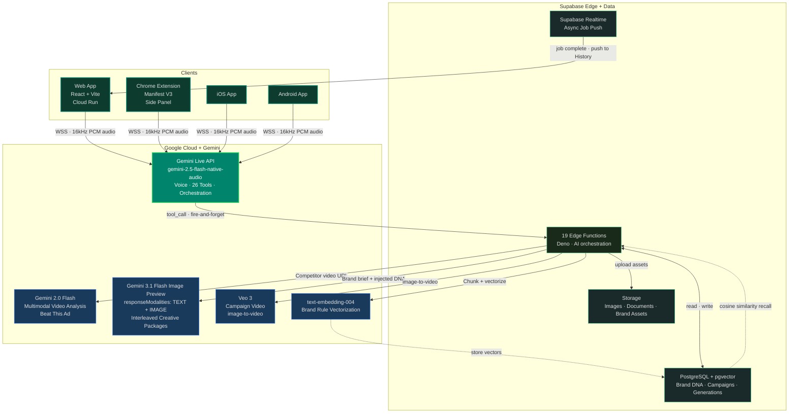

# Vince

Vince is a voice-driven AI creative director for brand teams. Brief a campaign by voice, and Vince generates complete creative packages — headlines, body copy, and images woven together — grounded in brand intelligence the system builds itself from your website and brand documents.

The core technical insight: a two-model architecture where Gemini Live API handles real-time voice and tool calling, while a separate `generateContent` call with `responseModalities: ['TEXT', 'IMAGE']` produces interleaved copy+image output (image models don't support function calling).

[DevPost Submission](https://devpost.com/...) | [Live Demo](https://vince-359575203061.us-central1.run.app/showcase)

---

## Architecture

Three Gemini models, one conversation. The Gemini Live API handles real-time voice and all 26 tool calls. A separate `generateContent` call with `responseModalities: ['TEXT', 'IMAGE']` produces interleaved copy+image output. Image models don't support function calling — that constraint produced a cleaner split than anything designed intentionally.



---

## Prerequisites

- Node 18+
- [Supabase CLI](https://supabase.com/docs/guides/cli)
- [gcloud CLI](https://cloud.google.com/sdk/docs/install) (for Cloud Run deployment)
- Gemini API key with access to Live API and image generation

---

## Environment Variables

Copy `.env.example` to `.env.local` and fill in:

```
VITE_SUPABASE_URL=        # Your Supabase project URL
VITE_SUPABASE_ANON_KEY=   # Your Supabase anon key
VITE_GEMINI_API_KEY=      # Your Gemini API key
```

---

## Setup

```bash
# 1. Clone
git clone <repo-url>
cd vince

# 2. Install dependencies
npm install

# 3. Configure environment
cp .env.example .env.local
# Edit .env.local with your values

# 4. Point to your Supabase project (or start local)
#    Hosted: set VITE_SUPABASE_URL and VITE_SUPABASE_ANON_KEY in .env.local
#    Local:  supabase start

# 5. Deploy edge functions
supabase functions deploy

# 6. Start dev server
npm run dev
```

Open `http://localhost:5173`.

---

## Chrome Extension

The extension adds Vince as a Chrome side panel alongside any website. It uses the root `node_modules` — no separate install needed.

```bash
# Build (from repo root)
cd extension && npx vite build
```

1. Open `chrome://extensions`
2. Enable **Developer mode**
3. Click **Load unpacked** and select the `extension/dist` folder
4. Click the Vince icon in Chrome's toolbar to open the side panel

To rebuild after code changes, re-run the build command and click the reload icon on the extension card in `chrome://extensions`.

---

## Mobile App (iOS & Android)

Vince runs as a Capacitor hybrid app — the same React codebase wrapped in a native shell. Five tabs: Chat, Brand (DNA viewer), Prompts (Gemini-powered prompt generator), Campaigns (generated image gallery), and Media.

See [mobile/README.md](mobile/README.md) for the full spec — architecture, tab descriptions, iOS/Android platform notes, and environment variable setup.

### Prerequisites

- **iOS**: Xcode 15+ with a valid Apple developer account or personal team
- **Android**: Android Studio with SDK 33+
- **Both**: [Capacitor CLI](https://capacitorjs.com/docs/getting-started) (`npm install -g @capacitor/cli`)

### Build & deploy workflow

Every time you change source code, run these steps before opening the native IDE:

```bash
# 1. Build the web bundle
cd mobile && npx vite build

# 2. Copy web assets into native projects
npx cap sync          # syncs both iOS and Android
# or target one platform:
npx cap sync ios
npx cap sync android
```

### iOS (Xcode)

```bash
npx cap open ios      # opens Xcode
```

In Xcode:
1. Select your target device or simulator
2. Press **Run** (▶)

### Android (Android Studio)

```bash
npx cap open android  # opens Android Studio
```

In Android Studio:
1. Wait for Gradle sync to complete
2. Select your target device or emulator
3. Press **Run** (▶)

> **Note:** The Android project (`mobile/android/`) is git-ignored. If it's missing, run `npx cap add android` from the `mobile/` directory, then `npx cap sync android`.

---

## Tech Stack

| Layer | Technology |
|-------|-----------|
| Frontend | React 18, TypeScript, Vite, Tailwind CSS, shadcn/ui |
| Voice AI | Gemini 2.5 Flash Live API (WebSocket, bidirectional audio + tool calling) |
| Image AI | Gemini 3.1 Flash Image Preview (interleaved TEXT + IMAGE output) |
| Text AI | Gemini 3 Flash (brand analysis, document processing) |
| Video AI | Veo 3 (campaign video generation) |
| Backend | Supabase (PostgreSQL, Edge Functions, Auth, Storage, Realtime) |
| Hosting | Google Cloud Run |
| Extension | Chrome Manifest V3 (side panel) |
