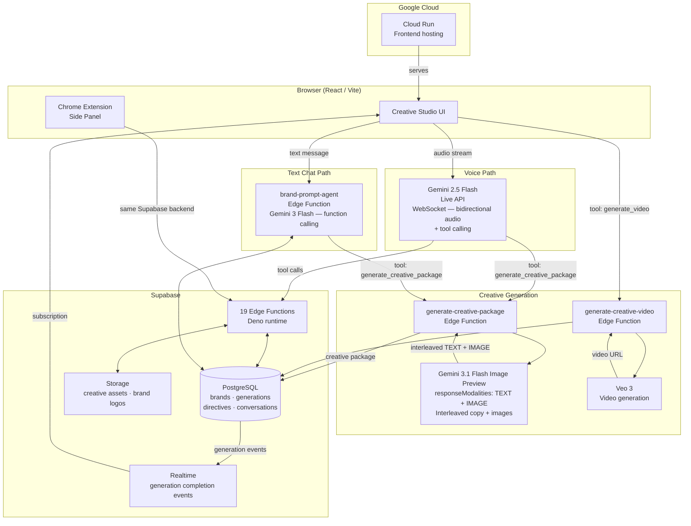

# Vince — System Architecture

## Key Design Decisions

**Two-model architecture.** Gemini Live API handles real-time voice and tool calling. Image generation requires a separate `generateContent` call because image models don't support function calling. When Vince decides to generate a creative package, the Live session fires a tool call, the backend makes a separate call with `responseModalities: ['TEXT', 'IMAGE']`, and results render on the frontend while Vince keeps talking.

**Brand intelligence pipeline.** Vince starts from nothing. Every brand is built live: website crawl → document import → profile synthesis → guardrail generation → prompt synthesis. The final synthesized prompt injects brand DNA (visual identity, photography style, color profile, tone of voice) into every generation call.

**Realtime generation updates.** Creative package generation takes 4–6 seconds. Rather than polling, the frontend subscribes to Supabase Realtime and renders results as they arrive, while the Live API plays filler speech to bridge dead air.

**Edge Functions (19 total).** All AI orchestration runs in Supabase Edge Functions (Deno runtime), keeping API keys server-side and enabling per-function scaling.
