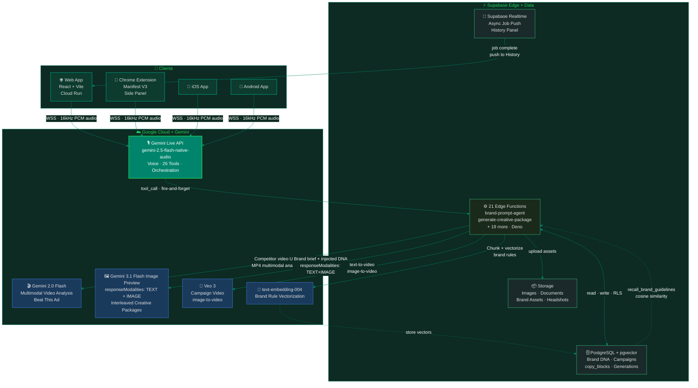
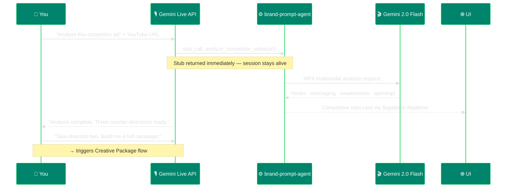
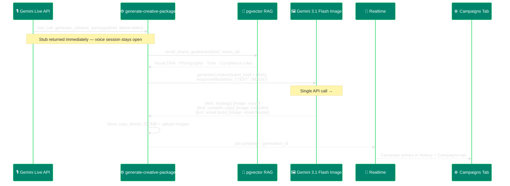
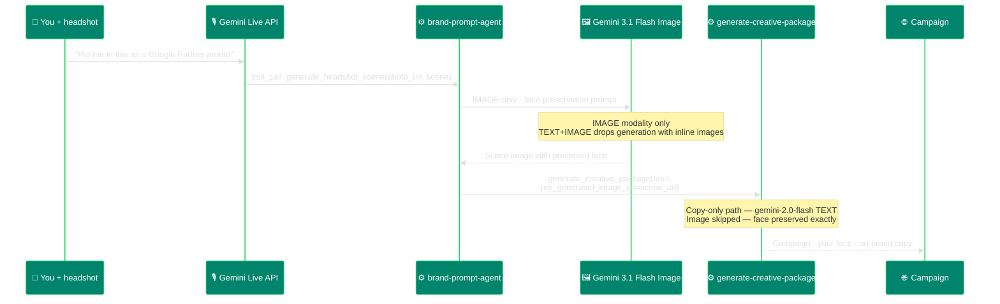

# Vince — Architecture Diagram

## System Architecture

---

## Key Flow: Beat This Ad

---

## Key Flow: Interleaved Creative Package

---

## Key Flow: Person-in-Scene → Campaign

---

## Why Two Models

| Model | Role | Why Separate |
|-------|------|-------------|
| `gemini-2.5-flash-native-audio` | Voice + tool orchestration | Real-time bidirectional audio, session lifecycle, 26 tool calls mid-conversation |
| `gemini-2.0-flash` | Video analysis + copy-only generation | Multimodal input (video), fast text; used when image already exists |
| `gemini-3.1-flash-image-preview` | Interleaved TEXT+IMAGE output | Only model supporting `responseModalities: ['TEXT', 'IMAGE']` |
| `text-embedding-004` | Brand memory vectors | Semantic retrieval — relevant rules for each generation type, not a full profile dump |
| `Veo 3` | Campaign video | Dedicated video generation; async job, fire-and-forget |

> Image generation models don't support function calling. This isn't a workaround — it forced a clean separation: Live API as pure orchestration, image model as pure creative execution. Each at its ceiling.
