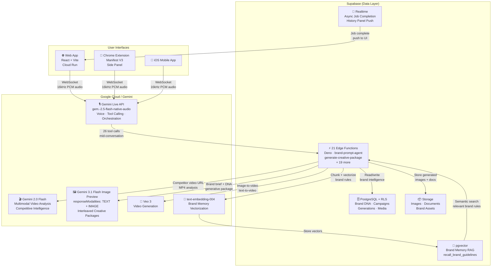

# Vince — Architecture Diagram

## Two-Model Architecture + RAG + Async



## The Key Flows

### Flow 1: Beat This Ad
```
User (voice) → Gemini Live → tool: analyze_competitor_video
  → Edge Function → Gemini 2.0 Flash (multimodal video)
  → Competitive Intel card appears in UI
  → User says "counter-campaign" → Flow 2
```

### Flow 2: Creative Package (Interleaved Output)
```
User (voice) → Gemini Live → tool: generate_creative_package
  → Edge Function fires async (stub result returned immediately)
  → recall_brand_guidelines → pgvector semantic search
  → Gemini 3.1 Flash Image Preview
    responseModalities: ['TEXT', 'IMAGE']
  → [text: LinkedIn copy] [image: LinkedIn visual]
    [text: Email body]    [image: Email header]
    [text: Banner copy]   [image: Display banner]
  → Supabase Realtime → History panel
  → Campaigns archive (copy_blocks JSONB + image URLs)
```

### Flow 3: Person-in-Scene → Campaign
```
User uploads headshot → voice: "put me in this as a Google Partner promo"
  → Gemini Live → tool: generate_headshot_scene
    → Gemini 3.1 Flash Image Preview (IMAGE only)
    → Face-preserved scene image → Storage
  → tool: generate_creative_package (pre_generated_image_url set)
    → gemini-2.0-flash TEXT only (copy wraps the face image)
    → Campaign with real face + on-brand copy
```

### Flow 4: Brand Memory RAG
```
Any generation request
  → recall_brand_guidelines(query, brand_id)
  → text-embedding-004 embeds the query
  → pgvector cosine similarity search
  → Top K brand rules for this generation type injected
  → Never a 10,000-token system prompt dump
```

## Why Two Models

| Model | Role | Why |
|-------|------|-----|
| `gemini-2.5-flash-native-audio` (Live) | Voice + orchestration | Real-time bidirectional audio, tool calling, conversation management |
| `gemini-2.0-flash` | Video analysis, copy-only generation | Multimodal input (video), fast text generation |
| `gemini-3.1-flash-image-preview` | Interleaved TEXT+IMAGE | Only model supporting `responseModalities: ['TEXT', 'IMAGE']` |
| `text-embedding-004` | Brand memory | Semantic search, brand rule retrieval |
| `Veo 3` | Video | Campaign video generation |

Image models don't support function calling. This isn't a limitation — it's a clean separation of concerns. The Live session orchestrates; the image model executes. Each at its ceiling.
```
