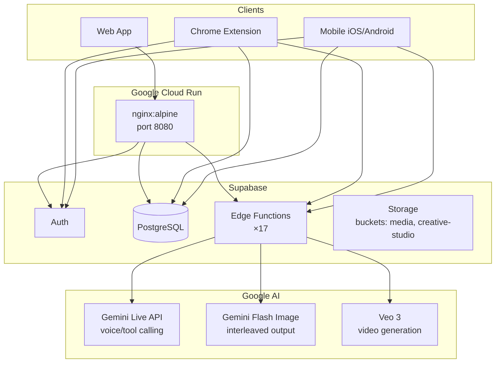

<!-- ABOUTME: Deployment guide for the Vince AI creative director platform. -->
<!-- ABOUTME: Covers web app (Docker/Cloud Run), Supabase edge functions, and all three surfaces (web, extension, mobile). -->

# Deployment Guide

## Architecture Overview



**✅ CONFIRMED** from `Dockerfile`, `nginx.conf`, `scripts/deploy-functions.sh`, `README.md`

---

## Prerequisites

| Requirement | Version | Notes |
|-------------|---------|-------|
| Node.js | 18+ | Build environment |
| Supabase CLI | latest | `npm install -g supabase` |
| gcloud CLI | latest | Cloud Run deployment |
| Docker | any | Container builds |
| Xcode | 15+ | iOS builds only |
| Android Studio | SDK 33+ | Android builds only |

---

## Web App Deployment

### Option A: Docker + Cloud Run (✅ CONFIRMED — `Dockerfile`, `nginx.conf`, `README.md`)

**Step 1: Build the container**

```bash
cd /path/to/vince
docker build -t vince-web .
```

Expected output:
```
[+] Building ...
 => FROM node:20-alpine AS build
 => RUN npm ci
 => RUN npx vite build
 => FROM nginx:alpine
 => COPY --from=build /app/dist /usr/share/nginx/html
 => EXPOSE 8080
```

**Failure modes:**
1. `npm ci` fails with missing packages — run `npm install` locally first to regenerate `package-lock.json`, then commit it.
2. `tsc -b` TypeScript errors — resolve type errors before building; the build script (`npm run build`) runs `tsc -b && vite build`.
3. Build fails with `VITE_SUPABASE_URL` missing — environment variables must be provided at build time via `--build-arg` or a `.env.local` file present in the build context.

**Step 2: Push to Google Artifact Registry**

```bash
docker tag vince-web gcr.io/YOUR_PROJECT_ID/vince-web:latest
docker push gcr.io/YOUR_PROJECT_ID/vince-web:latest
```

**Step 3: Deploy to Cloud Run**

```bash
gcloud run deploy vince-web \
  --image gcr.io/YOUR_PROJECT_ID/vince-web:latest \
  --platform managed \
  --region us-central1 \
  --allow-unauthenticated \
  --port 8080 \
  --set-env-vars VITE_SUPABASE_URL=https://YOUR_PROJECT.supabase.co,VITE_SUPABASE_ANON_KEY=YOUR_KEY,VITE_GEMINI_API_KEY=YOUR_KEY
```

Expected output:
```
Service [vince-web] revision [vince-web-00001] has been deployed and is serving 100 percent of traffic.
Service URL: https://vince-web-HASH-uc.a.run.app
```

**Failure modes:**
1. `ERROR: (gcloud.run.deploy) PERMISSION_DENIED` — run `gcloud auth login` and `gcloud config set project YOUR_PROJECT_ID`.
2. Container exits immediately — check Cloud Run logs: `gcloud logging read "resource.type=cloud_run_revision" --limit 50`. nginx config issue or missing env vars.
3. 502 Bad Gateway — nginx is not starting. Verify port 8080 matches `--port 8080` and `nginx.conf` `listen 8080`.

### Option B: Local Development Server

```bash
# Install dependencies
npm install

# Configure environment
cp .env.example .env.local
# Edit .env.local — set VITE_SUPABASE_URL, VITE_SUPABASE_ANON_KEY, VITE_GEMINI_API_KEY

# Start dev server
npm run dev
```

Expected output:
```
  VITE v5.x.x  ready in xxx ms
  ➜  Local:   http://localhost:5173/
```

---

## Supabase Edge Functions Deployment

**⚠️ CRITICAL: All 17 edge functions MUST deploy with `--no-verify-jwt`. Omitting this flag causes 401 errors on every function call.** (✅ CONFIRMED — `scripts/deploy-functions.sh`, `CLAUDE.md`)

### Deploy all functions (recommended)

```bash
npm run deploy:functions
```

This runs `scripts/deploy-functions.sh`, which deploys all 17 functions with `--no-verify-jwt`.

Expected output:
```
Deploying brand-prompt-agent...
Deploying analyze-brand-website...
...
All 17 functions deployed.
```

**Failure modes:**
1. `Error: Cannot find supabase CLI` — install with `npm install -g supabase` and authenticate with `supabase login`.
2. `Error: Project not linked` — run `supabase link --project-ref YOUR_PROJECT_REF`.
3. Individual function fails to deploy — deploy it individually: `supabase functions deploy FUNCTION_NAME --no-verify-jwt`. Check function code for syntax errors.

### Deploy a single function

```bash
supabase functions deploy FUNCTION_NAME --no-verify-jwt
```

### Functions inventory (✅ CONFIRMED — `scripts/deploy-functions.sh`)

| Function | Purpose |
|----------|---------|
| `brand-prompt-agent` | Core AI agent for brand interactions and tool calling |
| `analyze-brand-website` | Scrapes and analyzes brand websites |
| `synthesize-brand-profile` | Builds brand DNA from collected signals |
| `generate-creative-package` | Gemini interleaved text+image creative output |
| `generate-creative-image` | Single image generation via Gemini/Imagen |
| `generate-creative-video` | Video generation via Veo 3 |
| `analyze-competitor-video` | Competitor content intelligence |
| `analyze-brand-documents` | Processes uploaded brand documents |
| `analyze-brand-images` | Visual analysis of brand imagery |
| `generate-brand-guardrails` | Brand compliance rule generation |
| `enhance-director-prompt` | AI prompt enhancement |
| `analyze-expansion-direction` | Brand expansion opportunity analysis |
| `generate-brand-prompt` | Brand-specific prompt generation |
| `generate-brand-starters` | Starter prompt generation for new brands |
| `synthesize-generation-prompt` | Final prompt synthesis before generation |
| `generate-brand-card-images` | Brand card hero image generation |
| `generate-header-image` | Admin section header image generation |
| `generate-studio-welcome-images` | Welcome screen image generation |

---

## Database Migrations

Migrations live in `supabase/migrations/`. Apply them in order when setting up a new environment.

```bash
# Apply all pending migrations
supabase db push

# Or on hosted Supabase, migrations apply automatically on push
```

### Migration history (✅ CONFIRMED)

| File | Description |
|------|-------------|
| `20260313211248_add_prompt_versions.sql` | Adds `prompt_versions` table for Brand DNA version history |
| `20260315000000_add_archived_at_to_generations.sql` | Soft-delete column on `creative_studio_generations` |
| `20260315000001_allow_admin_delete_generations.sql` | Admin override on DELETE policy for generations |

**Failure modes:**
1. Migration fails with `column already exists` — the migration uses `IF NOT EXISTS`; this indicates a partially applied state. Check `supabase_migrations` table.
2. `has_role function not found` — `20260315000001` calls `has_role(uid, 'admin'::app_role)`. This function must exist in the database before applying this migration. ⚠️ REQUIRES VERIFICATION: the `has_role` function definition was not found in the included migration files.

---

## Chrome Extension Deployment

```bash
# Build (run from repo root)
cd extension && npx vite build
```

Expected output: compiled files in `extension/dist/`.

**To load in Chrome:**
1. Navigate to `chrome://extensions`
2. Enable **Developer mode** (toggle, top-right)
3. Click **Load unpacked**, select `extension/dist/`

**Failure modes:**
1. Build fails — extension uses root `node_modules`; run `npm install` from repo root, not inside `extension/`.
2. Extension fails to load — check manifest version; extension uses Manifest V3.
3. Side panel does not open — click the Vince icon in Chrome toolbar; side panel requires explicit activation.

---

## Mobile App Deployment

**⚠️ Always run `vite build && cap sync` before opening the native IDE. The native shell serves the compiled bundle from `mobile/dist/`.** (✅ CONFIRMED — `CLAUDE.md`)

```bash
# Build web bundle
cd mobile && npx vite build

# Sync to native projects
npx cap sync          # both platforms
npx cap sync ios      # iOS only
npx cap sync android  # Android only

# Open native IDE
npx cap open ios      # Xcode
npx cap open android  # Android Studio
```

**Failure modes:**
1. `android/` directory missing — run `npx cap add android` from `mobile/`, then `npx cap sync android`. (✅ CONFIRMED — `README.md`)
2. Stale assets in native IDE — always run `vite build && cap sync` before opening Xcode or Android Studio.
3. iOS build fails with signing error — configure a valid Apple developer account or personal team in Xcode under the target's Signing & Capabilities tab.
