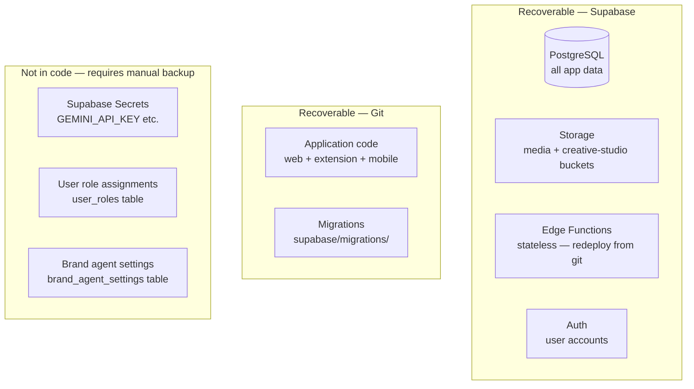

<!-- ABOUTME: Disaster recovery procedures for the Vince platform. -->
<!-- ABOUTME: Covers data backup strategy, Supabase project recovery, and service restoration steps. -->

# Disaster Recovery

## Infrastructure Map

Understanding what can fail and where data lives:



---

## Recovery Point Objective (RPO) and Recovery Time Objective (RTO)

⚠️ REQUIRES VERIFICATION: No formal RTO/RPO targets are defined in the codebase. The following are estimates based on architecture.

| Scenario | Estimated RTO | Data loss risk |
|----------|--------------|----------------|
| Cloud Run service down | ~10 min (redeploy) | None |
| Edge functions lost | ~5 min (redeploy script) | None |
| Supabase project paused | ~2 min (resume from dashboard) | None |
| Supabase project deleted | Hours (restore from backup) | Depends on backup age |
| Gemini API key rotated | ~5 min | None |

---

## Scenario 1: Web App Down (Cloud Run)

**Symptoms:** Browser returns 502 or timeout when accessing the app URL.

**Diagnosis:**
```bash
# Check Cloud Run service status
gcloud run services describe vince-web --region us-central1

# View recent logs
gcloud logging read "resource.type=cloud_run_revision AND resource.labels.service_name=vince-web" --limit 50
```

**Recovery:**
```bash
# Redeploy from the last known-good image
gcloud run deploy vince-web \
  --image gcr.io/YOUR_PROJECT_ID/vince-web:latest \
  --platform managed \
  --region us-central1 \
  --port 8080

# Or rebuild and redeploy from source
docker build -t gcr.io/YOUR_PROJECT_ID/vince-web:latest .
docker push gcr.io/YOUR_PROJECT_ID/vince-web:latest
gcloud run deploy vince-web --image gcr.io/YOUR_PROJECT_ID/vince-web:latest --platform managed --region us-central1 --port 8080
```

**Validation:** HTTP GET to the Cloud Run URL returns 200 with the app HTML.

---

## Scenario 2: Edge Functions Down or Returning 401

**Symptoms:** All AI features fail; browser console shows 401 responses from Supabase function endpoints.

**Root cause:** Functions deployed without `--no-verify-jwt`, or functions not deployed at all. (✅ CONFIRMED — `CLAUDE.md`, `scripts/deploy-functions.sh`)

**Recovery:**
```bash
# Redeploy all functions with the correct flag
npm run deploy:functions
```

Expected output: `All 17 functions deployed.`

**Validation:**
```bash
# Test one function directly
curl -X POST https://YOUR_PROJECT.supabase.co/functions/v1/generate-brand-starters \
  -H "Authorization: Bearer YOUR_ANON_KEY" \
  -H "Content-Type: application/json" \
  -d '{"brand_id": "test"}'
```
A 400 or 200 response (not 401) confirms the function is reachable.

---

## Scenario 3: Supabase Project Paused

**Symptoms:** All database queries fail; auth returns errors; app shows blank or error state.

**Diagnosis:** Free-tier Supabase projects pause after 1 week of inactivity.

**Recovery:**
1. Navigate to https://supabase.com/dashboard
2. Select the project
3. Click **Restore project**
4. Wait 1-2 minutes for the project to resume

**Validation:** Navigate to the app — auth flow completes and dashboard loads.

---

## Scenario 4: GEMINI_API_KEY Lost or Rotated

**Symptoms:** All AI generation fails; edge function logs show `GEMINI_API_KEY not configured`; voice mode disabled with `[Vince] API key unavailable` in browser console.

**Recovery:**
```bash
# Set the new key as a Supabase secret
supabase secrets set GEMINI_API_KEY=YOUR_NEW_KEY --project-ref YOUR_PROJECT_REF

# Redeploy functions to pick up the new secret
npm run deploy:functions
```

**Validation:** Initiate a brand analysis or image generation from the UI — it completes without error.

---

## Scenario 5: Database Schema Corruption or Migration Failure

**Symptoms:** Queries return unexpected column errors; app shows database errors.

**Recovery — apply pending migrations:**
```bash
supabase db push --project-ref YOUR_PROJECT_REF
```

**Recovery — restore from Supabase backup:**
1. Navigate to Supabase dashboard → Database → Backups
2. Select the desired restore point
3. Click **Restore**

⚠️ REQUIRES VERIFICATION: Backup availability and retention period depend on the Supabase plan. Verify backup configuration in the Supabase dashboard.

**Migration rollback:** No rollback scripts exist in the codebase. (❓ CONFIRMED — migrations directory contains only forward migrations.) Manual rollback requires:
1. Identifying the SQL inverse of the migration
2. Applying it via `supabase db execute` or the Supabase SQL editor

---

## Scenario 6: Storage Bucket Data Loss

**Symptoms:** Brand reference images or generated images return 404.

**Storage buckets:** `media` (brand assets) and `creative-studio` (generated images)

⚠️ REQUIRES VERIFICATION: No backup or replication configuration for storage buckets was found in the codebase. Supabase Storage backup strategy depends on your Supabase plan.

**Recovery path:**
- Generated images (`creative-studio` bucket): Regenerate via the UI — no permanent data loss from a functional standpoint since all generation inputs are stored in the database.
- Brand reference images (`media` bucket): Cannot be automatically regenerated. Users must re-upload from their original sources.

---

## Secret Inventory for Recovery

Store these securely outside the codebase (e.g., 1Password, Google Secret Manager):

| Secret | Where set | Recovery action |
|--------|-----------|----------------|
| `GEMINI_API_KEY` | `supabase secrets set` | Obtain from Google AI Studio, reset via `supabase secrets set` |
| `VITE_SUPABASE_URL` | `.env.local` / Cloud Run env | Available in Supabase dashboard → Settings → API |
| `VITE_SUPABASE_ANON_KEY` | `.env.local` / Cloud Run env | Available in Supabase dashboard → Settings → API |
| `SUPABASE_SERVICE_ROLE_KEY` | Auto-provisioned | Available in Supabase dashboard → Settings → API (keep private) |
