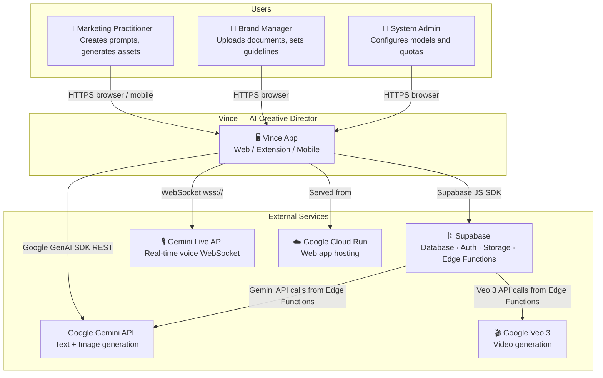
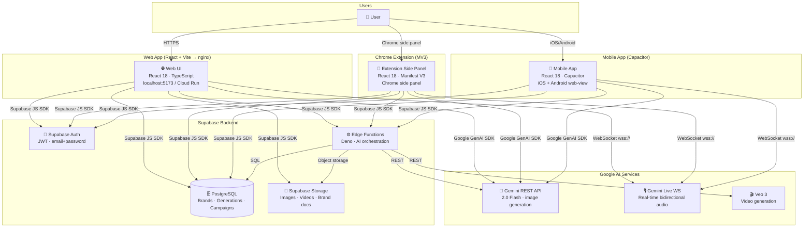
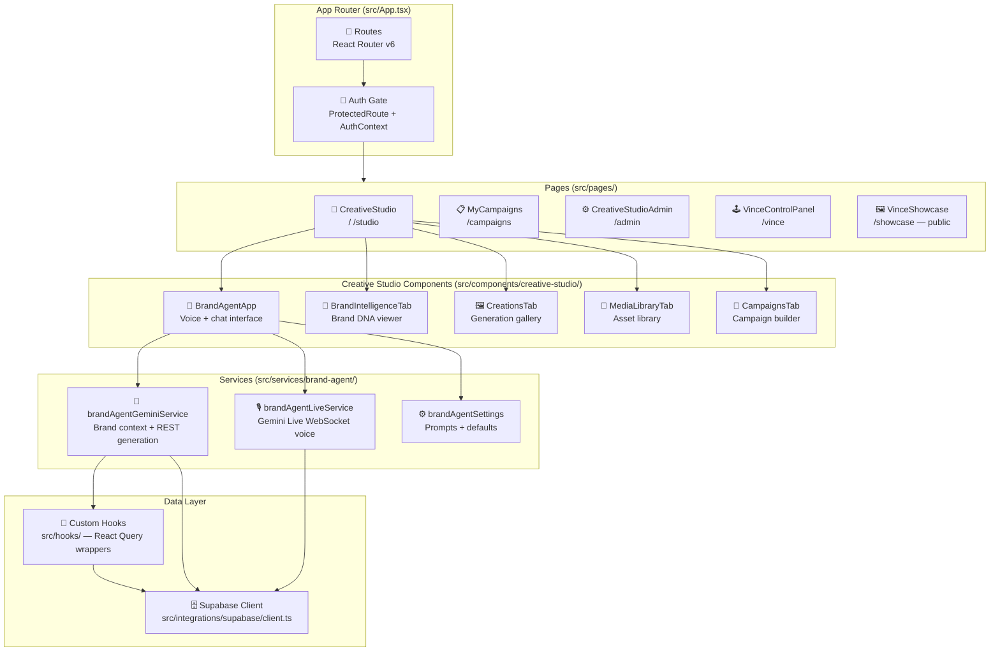

# Architecture Diagrams (C4-style)

> Generated: 2026-03-15
> Based on: `src/App.tsx`, `src/main.tsx`, `mobile/src/MobileApp.tsx`, `extension/src/BrandApp.tsx`,
> `src/integrations/supabase/client.ts`, `src/services/brand-agent/`, `supabase/functions/`,
> `extension/manifest.json`, `Dockerfile`

---

## Level 1: System Context Diagram

---

## Level 2: Container Diagram

---

## Level 3: Component Diagram — Web App (src/)

