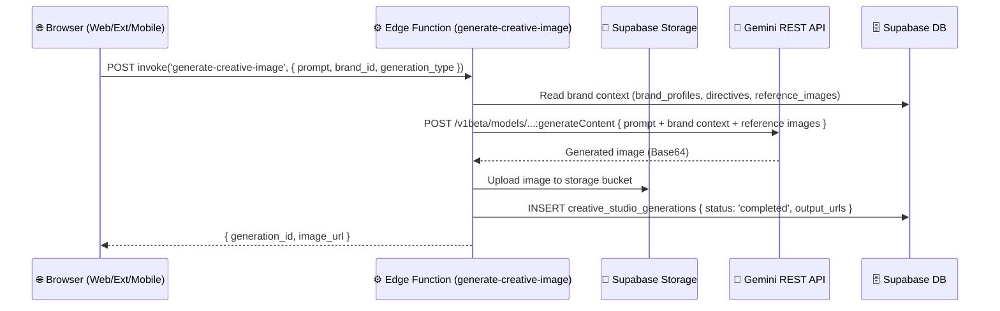
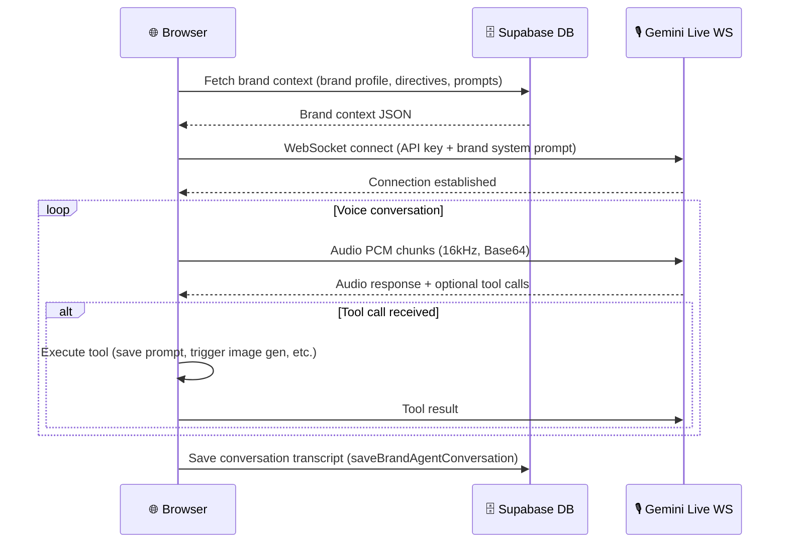

# Integrations

> Generated: 2026-03-15
> Source: `src/integrations/supabase/client.ts`, `src/services/brand-agent/`,
> `supabase/functions/*/index.ts`, `extension/manifest.json`

---

## External APIs Called by This System

### 1. Google Gemini REST API

**Status:** Always Active

**Base URL:** `https://generativelanguage.googleapis.com/v1beta` (CONFIRMED: `supabase/functions/generate-creative-image/index.ts:14`, `supabase/functions/generate-creative-video/index.ts:13`)

**Authentication:** API key — passed as query parameter `?key=<REDACTED_KEY>` or as `x-goog-api-key` header

**Key in edge functions:** `Deno.env.get('GEMINI_API_KEY')` (Supabase secret — server-side only)

**Key in browser:** `VITE_GEMINI_API_KEY` environment variable (client-visible — see [05-security-compliance.md](05-security-compliance.md) for risk assessment)

**Endpoints / Models Used:**

| Operation | Model | Function/File |
|-----------|-------|---------------|
| Text generation + brand context | `gemini-2.0-flash` | `src/services/brand-agent/brandAgentGeminiService.ts` |
| Text-to-image generation | `gemini-2.0-flash-preview-image-generation` | `supabase/functions/generate-creative-image/` |
| Multi-turn image editing | Gemini image model | `supabase/functions/generate-creative-image/` |
| Document analysis (PDF/PPTX) | `gemini-2.0-flash` | `supabase/functions/analyze-brand-documents/` |
| Brand prompt generation | `gemini-2.0-flash` | `supabase/functions/generate-brand-prompt/` |
| Competitor video analysis | `gemini-2.0-flash` | `supabase/functions/analyze-competitor-video/` |
| Brand image analysis | `gemini-2.0-flash` | `supabase/functions/analyze-brand-images/` |
| Website scraping + analysis | `gemini-2.0-flash` | `supabase/functions/analyze-brand-website/` |
| Brand guardrail generation | `gemini-2.0-flash` | `supabase/functions/generate-brand-guardrails/` |
| Header/card image generation | Gemini image model | `supabase/functions/generate-header-image/`, `supabase/functions/generate-brand-card-images/` |
| Welcome screen images | Gemini image model | `supabase/functions/generate-studio-welcome-images/` |
| Creative package generation | Gemini | `supabase/functions/generate-creative-package/` |

**Error Handling:** ⚠️ REQUIRES VERIFICATION — retry logic not confirmed in edge functions from surface review

---

### 2. Google Gemini Live API (WebSocket)

**Status:** Always Active (voice mode)

**Protocol:** WebSocket (`wss://`)

**Authentication:** API key passed in WebSocket connection params (client-side, `VITE_GEMINI_API_KEY`) — required by the Live API; server-side proxying is not supported

**Code Location:** `src/services/brand-agent/brandAgentLiveService.ts`

**Key Operations:**
- `connectVinceLiveSession()` — establishes WebSocket with brand context injected into system prompt
- `setApiKey()` — dynamic API key injection before connection
- `forceCleanup()` — tears down mic, audio contexts, and WebSocket on session end
- Audio pipeline: browser microphone → downsample to 16kHz → convert to 16-bit PCM → Base64 encode → send as realtime input
- Playback pipeline: Base64 PCM chunks from server → decode → enqueue to Web Audio API with precise timing
- Tool dispatch: `onToolStart` / `onToolResult` callbacks for function calling within voice conversation
- Resume handle stored for session recovery

**Fallback:** If WebSocket fails to connect, voice mode is unavailable. Text chat via REST continues to function.

---

### 3. Google Vertex AI

**Status:** Conditionally Active

**Activation:** Used automatically when the requested model is in the `VERTEX_AI_MODELS` list (CONFIRMED: `supabase/functions/generate-creative-image/index.ts:17-22`)

**Models routed to Vertex AI:**
- `imagen-4.0-upscale-preview`
- `virtual-try-on-001`
- `imagen-product-recontext-preview-06-30`

**Base URL:** `https://us-central1-aiplatform.googleapis.com/v1/projects/<REDACTED_PROJECT>/locations/us-central1/publishers/google/models`

**Configuration:** `VERTEX_AI_PROJECT` env var (default: `brand-lens`) — set in Supabase secrets

**Code Location:** `supabase/functions/generate-creative-image/index.ts:17-22`

---

### 4. Google Veo 3 (Video Generation)

**Status:** Always Active (for video generation requests)

**Base URL:** Same Gemini API endpoint (`https://generativelanguage.googleapis.com/v1beta`) — Veo is accessed via the Gemini API

**Polling:** Long-running operation polling with up to 120 attempts (`supabase/functions/generate-creative-video/index.ts:47-50`)

**Generation Types Supported:** `text_to_video`, `image_to_video`, `scene_extension`, `keyframe_video`, `ingredients_to_video`, `json_prompt_video`

**Code Location:** `supabase/functions/generate-creative-video/index.ts`

---

### 5. Supabase

**Status:** Always Active — core backend

**Client:** `src/integrations/supabase/client.ts`

**Configuration:** `VITE_SUPABASE_URL`, `VITE_SUPABASE_ANON_KEY` (client-side env vars)

**Services used:**

| Service | Purpose | Access Method |
|---------|---------|---------------|
| PostgreSQL | All application data (brands, generations, campaigns, prompts) | Supabase JS SDK (RLS-enforced) |
| Supabase Auth | User authentication, session management | `supabase.auth.*` |
| Supabase Storage | Brand documents, uploaded images, generated assets | `supabase.storage.*` |
| Edge Functions | AI orchestration, document processing | `supabase.functions.invoke()` |

**Surface overrides:**
- Web: `src/integrations/supabase/client.ts` — standard `createClient`
- Extension: `extension/src/supabaseExtClient.ts` — auth-aware client with Chrome storage
- Mobile: Custom override in mobile build — auth-aware client

---

## Exposed APIs (Called by External Systems)

### Supabase Edge Functions (HTTP)

All edge functions are exposed as HTTPS endpoints under the project's Supabase URL. They are called by the frontend surfaces via `supabase.functions.invoke()`.

**Auth model:** `verify_jwt: false` on all functions — each function validates the Authorization header internally. CORS is open (`Access-Control-Allow-Origin: *`) with preflight support.

**Endpoint inventory:**

| Function Name | Method | Purpose |
|---------------|--------|---------|
| `generate-brand-prompt` | POST | Generate on-brand text prompt |
| `analyze-brand-documents` | POST | Parse PDF/PPTX → brand JSON |
| `generate-creative-image` | POST | Text/image → generated image |
| `generate-creative-video` | POST | Prompt/image → video |
| `brand-prompt-agent` | POST | Multi-turn brand directive generation |
| `generate-brand-starters` | POST | Template-based onboarding prompts |
| `synthesize-generation-prompt` | POST | Brand profile → synthesis prompt |
| `synthesize-brand-profile` | POST | Aggregate brand data → profile |
| `extract-product-catalog` | POST | Parse product lists from docs |
| `analyze-brand-images` | POST | Image upload → visual analysis + embedding |
| `analyze-brand-website` | POST | Website URL → brand analysis |
| `analyze-competitor-video` | POST | Competitor video → strategic insights |
| `analyze-expansion-direction` | POST | Growth direction analysis |
| `generate-header-image` | POST | Brand card header image |
| `generate-brand-card-images` | POST | Brand card image set |
| `generate-studio-welcome-images` | POST | Welcome screen images |
| `generate-creative-package` | POST | Full creative asset package |
| `generate-brand-guardrails` | POST | Generate brand behavior rules |
| `enhance-director-prompt` | POST | Director mode prompt enhancement |

---

## Message Queues / Event Systems

Not applicable — no evidence of message queues, pub/sub, or event streaming found in codebase.

Long-running operations (video generation) use polling: the edge function polls the Gemini operation endpoint until completion, up to 120 attempts (`supabase/functions/generate-creative-video/index.ts:47-50`).

---

## Integration Sequence: Image Generation

---

## Integration Sequence: Voice Session

