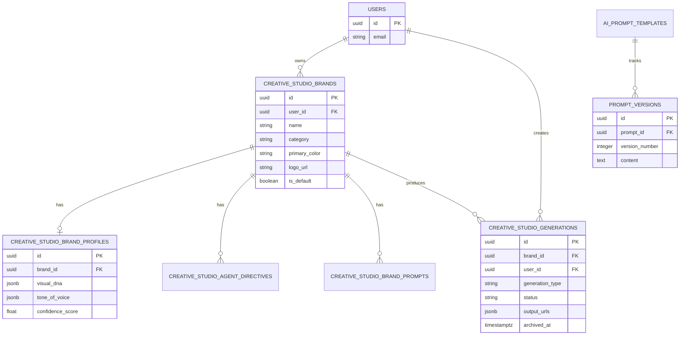
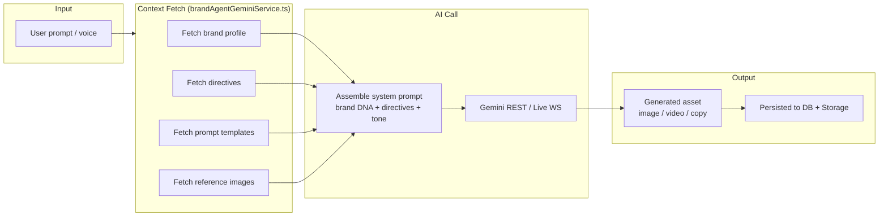

# Data Architecture

> Generated: 2026-03-15
> Source: `supabase/migrations/`, `src/services/brand-agent/brandAgentGeminiService.ts`,
> `src/types/creative-studio.ts`, `supabase/functions/*/index.ts`

---

## Data Storage Overview

| Store | Type | Purpose |
|-------|------|---------|
| Supabase PostgreSQL | Relational DB (managed) | All application state |
| Supabase Storage | Object storage (managed) | Binary assets: images, videos, brand documents |
| Browser memory / Web Audio API | Ephemeral | In-session audio buffers during voice calls |

No Redis, Memcached, or other caching layer found in codebase. No message broker found.

---

## Database Schema (CONFIRMED from migrations + service code)

> Table definitions are INFERRED from migration files and service query patterns.
> Column types marked ⚠️ where only inferred from usage, not a `CREATE TABLE` statement.

### `creative_studio_brands`

Core brand registry. One row per brand per user.

| Column | Type | Notes |
|--------|------|-------|
| `id` | uuid PK | |
| `user_id` | uuid FK → auth.users | Row-level owner |
| `name` | text | |
| `category` | text | `food`, `outdoor-apparel`, `healthcare`, `automotive`, `beauty`, `retail`, `financial`, `technology` |
| `description` | text nullable | |
| `brand_voice` | text nullable | Legacy flat field — superseded by `brand_profiles.tone_of_voice` |
| `visual_identity` | text nullable | Legacy flat field |
| `primary_color` | text nullable | Hex color |
| `secondary_color` | text nullable | Hex color |
| `logo_url` | text nullable | Storage URL |
| `is_default` | boolean | |
| `quick_prompts` | jsonb | Array of `QuickPrompt` objects |

Source: `src/types/creative-studio.ts` (`CreativeStudioBrand`), `src/services/brand-agent/brandAgentGeminiService.ts`

---

### `creative_studio_brand_profiles`

Structured brand intelligence, populated by document/image analysis.

| Column | Type | Notes |
|--------|------|-------|
| `id` | uuid PK | |
| `brand_id` | uuid FK → creative_studio_brands | |
| `visual_dna` | jsonb | Colors, shapes, mood, composition style |
| `photography_style` | jsonb | Lighting, framing, subject type |
| `color_profile` | jsonb | Primary/secondary/accent palette + usage rules |
| `composition_rules` | jsonb | Layout and focal point guidelines |
| `product_catalog` | jsonb | Extracted product list |
| `brand_identity` | jsonb | Mission, values, personality |
| `tone_of_voice` | jsonb | Writing style, vocabulary, register |
| `typography` | jsonb | Font preferences and usage |
| `brand_standards` | jsonb | Do/don't rules |
| `brand_story` | jsonb | Origin, positioning narrative |
| `total_images_analyzed` | int | Count of analyzed images |
| `confidence_score` | float | AI confidence in profile accuracy |

Source: `src/services/brand-agent/brandAgentGeminiService.ts:fetchBrandContext()`

---

### `creative_studio_agent_directives`

AI behavior configuration per brand.

| Column | Type | Notes |
|--------|------|-------|
| `id` | uuid PK | |
| `brand_id` | uuid FK → creative_studio_brands | |
| `name` | text | |
| `persona` | text | System persona instruction |
| `rules` | jsonb | Behavior rules array |
| `forbidden_combinations` | jsonb | What the AI must never do |
| `required_elements` | jsonb | What must always appear in output |
| `tone_guidelines` | jsonb | Tone directives |

Source: `src/services/brand-agent/brandAgentGeminiService.ts:fetchBrandContext()`

---

### `creative_studio_brand_prompts`

Reusable prompt templates per brand.

| Column | Type | Notes |
|--------|------|-------|
| `id` | uuid PK | |
| `brand_id` | uuid FK → creative_studio_brands | |
| `name` | text | |
| `category` | text | |
| `prompt_template` | text | Template with <code v-pre>{{variable}}</code> placeholders |
| `locked_parameters` | jsonb | Parameters that cannot be overridden |
| `camera_preset` | jsonb | Optional camera preset preset |
| `usage_count` | int | |

Source: `src/types/creative-studio.ts` (`CreativeStudioBrandPrompt`), `src/hooks/`

---

### `creative_studio_generations`

All generated images, videos, and creative packages.

| Column | Type | Notes |
|--------|------|-------|
| `id` | uuid PK | |
| `user_id` | uuid FK → auth.users | |
| `brand_id` | uuid FK → creative_studio_brands | nullable |
| `generation_type` | text | See GenerationType union below |
| `model_id` | text | Model used |
| `prompt` | text | Final prompt sent to AI |
| `status` | text | `pending`, `processing`, `completed`, `failed` |
| `output_urls` | jsonb | Array of generated asset URLs in Supabase Storage |
| `metadata` | jsonb | Generation parameters, cost, timing |
| `archived_at` | timestamptz nullable | NULL = active; populated = soft-deleted |
| `created_at` | timestamptz | |

**GenerationType values** (CONFIRMED: `src/types/creative-studio.ts`):
`text_to_image`, `image_to_image`, `image_edit`, `inpainting`, `outpainting`, `upscaling`, `product_recontext`, `virtual_try_on`, `multi_turn_edit`, `object_remove`, `object_insert`, `background_swap`, `text_to_video`, `image_to_video`, `keyframe_video`, `ingredients_to_video`, `json_prompt_video`, `scene_extension`, `creative_package`, `brand_card`

Source: `src/types/creative-studio.ts`, `supabase/migrations/20260315000000_add_archived_at_to_generations.sql`

---

### `creative_studio_models`

Available AI models, managed by admin.

| Column | Type | Notes |
|--------|------|-------|
| `id` | uuid PK | |
| `name` | text | |
| `model_id` | text | Provider model ID string |
| `model_type` | text | `image` or `video` |
| `provider` | text | |
| `capabilities` | jsonb | Array of `ModelCapability` values |
| `parameters` | jsonb | Default generation parameters |
| `cost_per_generation` | float | |
| `is_active` | boolean | |
| `is_default` | boolean | |
| `sort_order` | int | |

Source: `src/types/creative-studio.ts` (`CreativeStudioModel`)

---

### `prompt_versions`

Version history for brand prompt templates (CONFIRMED from migration).

| Column | Type | Notes |
|--------|------|-------|
| `id` | uuid PK | |
| `prompt_id` | uuid FK → ai_prompt_templates(id) ON DELETE CASCADE | |
| `content` | text | Prompt text at this version |
| `version_number` | integer | |
| `change_summary` | text nullable | |
| `created_at` | timestamptz | |
| `created_by` | uuid FK → auth.users nullable | |

Source: `supabase/migrations/20260313211248_add_prompt_versions.sql`

---

### `ai_prompt_templates`

Referenced by `prompt_versions` as the parent table holding the active version.
⚠️ REQUIRES VERIFICATION — referenced in migration FK but no `CREATE TABLE` migration found in the three available migration files. Table likely exists from an earlier migration not present in the current migration set.

---

## Entity Relationship Diagram

---

## File Storage

All binary assets are stored in Supabase Storage (managed S3-compatible object storage).

**Asset Types:**
- Brand documents (PDF, PPTX, DOCX) — uploaded by user during brand onboarding
- Brand images — uploaded during brand image analysis
- Generated images — written by `generate-creative-image` edge function
- Generated videos — written by `generate-creative-video` edge function
- Brand logos — uploaded by user

**Access pattern:** Supabase Storage URLs referenced in `output_urls` (jsonb array) on `creative_studio_generations` rows and `logo_url` on `creative_studio_brands`.

---

## Data Flow: Brand Context Injection

---

## Schema Evolution

**Migration strategy:** Incremental SQL files in `supabase/migrations/` with timestamp-prefixed filenames (e.g., `20260315000000_*.sql`). Applied via Supabase CLI.

**Known migrations (from available files):**
- `20260313211248_add_prompt_versions.sql` — adds `prompt_versions` table with RLS
- `20260315000000_add_archived_at_to_generations.sql` — adds soft-delete column to `creative_studio_generations`
- `20260315000001_allow_admin_delete_generations.sql` — adds admin override DELETE policy

**Schema history note:** Only 3 migration files are present in the repo. The full table creation DDL for core tables (e.g., `creative_studio_brands`, `creative_studio_generations`) is not in these files. Earlier migrations likely exist but are not included in the current working copy.

---

## Shadow Dependencies

### Brand Profile ↔ Generation Quality

**Shadow Dependency:** `creative_studio_brand_profiles` is read by every edge function that performs AI generation. Stale or missing brand profile data silently degrades generation quality without error.

- **Accessed By:** `generate-creative-image`, `generate-creative-video`, `generate-brand-prompt`, `brandAgentGeminiService.ts`, all edge functions
- **Mutation Risk:** Brand profile is written by `analyze-brand-documents`, `analyze-brand-images`, and `synthesize-brand-profile`. If these writes fail partway, partial profile data enters generation — no validation layer guards against this.
- **Monitoring:** ⚠️ REQUIRES VERIFICATION — no dedicated alerting on brand profile completeness found

### `creative_studio_generations.archived_at`

**Shadow Dependency:** Soft-delete pattern. Gallery views must filter `archived_at IS NULL` — any query that omits this filter will silently include archived content.

- **Accessed By:** `CreationsTab.tsx`, any admin view reading generations
- **Mutation Risk:** New queries added without the `archived_at IS NULL` filter will surface deleted content
- **Monitoring:** Code review responsibility only — no automated guard
