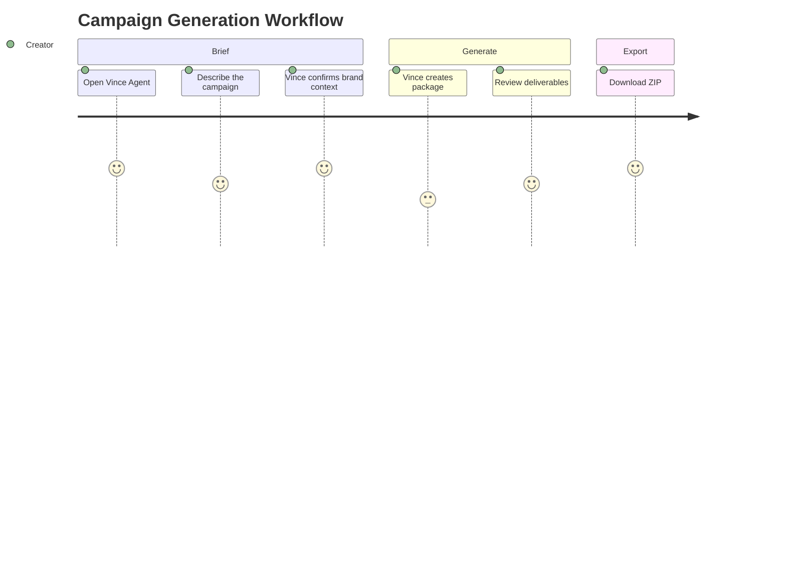
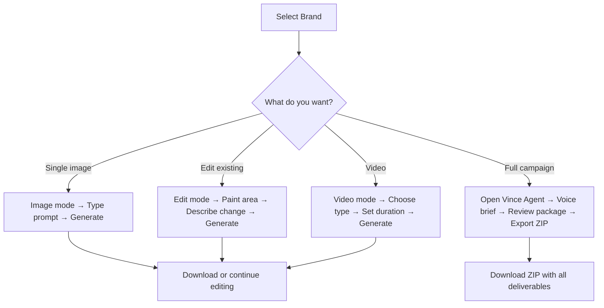

# Generation Workflows

Learn how to create images, videos, and full campaign packages — and how to edit and refine your work.

---

## Choosing a Generation Mode

The **mode selector** sits inside the prompt bar at the bottom of the screen. Click it to switch between modes.

📷 [SCREENSHOT NEEDED: Mode selector open, showing available modes]

> **CONFIRMED** — `src/components/creative-studio/BrandShopPromptBar.tsx`

---

## How to Generate an Image

**Mode:** Image

This is the default mode. Describe what you want and Vince generates it from scratch.

1. Select your brand from the top bar
2. Click the prompt bar at the bottom
3. Type your description
4. Make sure the mode is set to **Image**
5. Press **Enter** or click the Generate button

📷 [SCREENSHOT NEEDED: Prompt bar in Image mode with a sample prompt]

**Result:** Your image appears on the canvas and is saved to History.

**Adjusting the look:**
- Open the **Parameters** panel on the right to change aspect ratio, resolution, and other settings
- Try different prompts — small word changes can produce very different results

> **CONFIRMED** — `src/components/creative-studio/ParametersPanel.tsx`; generation types in `src/types/creative-studio.ts`

---

## How to Edit an Existing Image

**Mode:** Edit (also called Inpainting)

Use this when you want to change a specific area of an image — swap a background, remove an object, change a color.

1. Generate an image or click one from History to load it on the canvas
2. Switch mode to **Edit**
3. Use the **brush tool** to paint over the area you want to change
4. Describe what you want in that area in the prompt bar
5. Click Generate

📷 [SCREENSHOT NEEDED: Canvas with masking brush visible on an image, painted area highlighted]

**Eraser:** Use the eraser tool in the masking canvas to undo parts of your painted selection before generating.

> **CONFIRMED** — `src/components/creative-studio/MaskingCanvas.tsx`

---

## How to Expand an Image (Outpainting)

**Mode:** Edit → Outpaint direction

Use this to extend an image beyond its original edges — useful for turning a square image into a widescreen banner.

1. Load an image on the canvas
2. Switch to **Edit** mode
3. In the masking canvas, choose an outpaint direction: **up, down, left, right,** or **all**
4. Add a prompt describing what the expanded area should look like (or leave blank to let Vince infer)
5. Click Generate

📷 [SCREENSHOT NEEDED: Outpaint direction selector on the masking canvas]

> **CONFIRMED** — `src/components/creative-studio/MaskingCanvas.tsx` (outpainting directions listed)

---

## How to Upscale an Image

**Mode:** Upscale

Use this to increase the resolution of an image for large-format print or high-quality exports.

1. Load an image on the canvas
2. Switch mode to **Upscale**
3. Choose your quality options in the panel that appears
4. Click Generate

📷 [SCREENSHOT NEEDED: Upscale mode panel with quality options]

> **CONFIRMED** — `src/components/creative-studio/UpscalePanel.tsx` referenced in generation types

---

## How to Use Conversational Editing

**Mode:** Conversation

This mode lets you refine an image through back-and-forth dialogue. Vince remembers the full context of your edits, so you can say things like "make it warmer" or "remove the person on the left" without re-describing the whole image.

1. Generate or load an image
2. Switch mode to **Conversation**
3. Type your edit request in the prompt bar (e.g., *"Move the product to the right side"*)
4. Vince edits and shows the result
5. Continue refining with follow-up requests

📷 [SCREENSHOT NEEDED: Conversational edit panel with multi-turn thread visible]

**How it works behind the scenes:** Vince stores a "thought signature" that tracks what it knows about your image across edits, so each instruction builds on the last.

> **CONFIRMED** — `src/components/creative-studio/ConversationalEditPanel.tsx`; `src/types/creative-studio.ts` (`multi_turn_edit` type)

---

## How to Generate a Video

**Mode:** Video

Vince can create short videos from a text description, animate a starting image, or extend an existing video.

1. Switch mode to **Video**
2. The **Video Generation** panel opens on the right side
3. Choose a video type:

| Type | What it does |
|------|-------------|
| **Text to Video** | Generates a video from your description |
| **Image to Video** | Animates a starting image (8 seconds) |
| **Keyframe Video** | Morphs between a first and last frame (8 seconds) |
| **Extend Video** | Extends an existing video up to ~2.5 minutes |

4. Set your duration and resolution
5. Write your prompt (or use **Director Mode** for precise control — see below)
6. Click Generate

📷 [SCREENSHOT NEEDED: Video generation panel with type selector and settings visible]

**Director Mode:** Turn this on to describe your video as a structured scene — camera movement, lighting, subject action, dialogue. This gives you precise control over the shot.

> **CONFIRMED** — `src/components/creative-studio/VideoGenerationPanel.tsx`

---

## How to Generate a Campaign Package (Voice)

A campaign package is a full set of creative deliverables — social posts, banners, email headers, and more — all generated in one briefing session via the **Vince voice interface**.

**Step by step:**

1. Click the **Vince Agent** button (microphone/chat icon)

   📷 [SCREENSHOT NEEDED: Vince Agent button location in the studio]

2. The voice interface opens. You'll see an animated visualizer and a microphone button.

   📷 [SCREENSHOT NEEDED: Voice overlay open with visualizer and mic button]

3. Speak your campaign brief — for example:
   > *"Create a campaign for our summer product relaunch. We need LinkedIn posts, a display banner, and an email header. Energetic, warm tones, product-forward."*

4. Vince responds in real time. It will:
   - Pull up the brand's guidelines and visual DNA automatically
   - Ask clarifying questions if needed
   - Generate each deliverable with appropriate copy and imagery

5. Review the finished package — each deliverable shows its format, dimensions, and category

   📷 [SCREENSHOT NEEDED: Creative package display with deliverables listed]

6. Click **Download ZIP** to export everything in organized folders

> **CONFIRMED** — `src/components/creative-studio/BrandAgentApp.tsx`; `src/components/creative-studio/CampaignsTab.tsx`; `src/components/creative-studio/CreativePackageDisplay.tsx`

---

## Campaign Deliverable Types

Vince can generate these formats in a campaign package:

**Social**
- LinkedIn post (image + copy)
- Product shot
- Story (9:16 vertical)
- TikTok / Reels
- Instagram feed

**Email**
- Email header

**Display Advertising**
- Display banner (16:9)
- Leaderboard
- Skyscraper

**Print / OOH**
- Full page print
- Billboard (OOH)
- Transit shelter
- Direct mail
- Sell sheet / collateral

> **CONFIRMED** — deliverable types defined in `src/types/creative-studio.ts`

---

## How to Browse Past Campaigns

1. Click **Campaigns** in the navigation (or the Campaigns tab)
2. Browse your archive of past campaign packages
3. Click any campaign to see:
   - The full conversation transcript (what you asked for)
   - Strategic analysis Vince performed
   - All deliverables with images and copy
4. Click **Download ZIP** to re-export any past campaign

📷 [SCREENSHOT NEEDED: Campaigns tab with campaign cards and detail view]

> **CONFIRMED** — `src/components/creative-studio/CampaignsTab.tsx`

---

## How to Use Camera Controls

For precise photography-style control, open **Camera Controls** from the Parameters panel.

Settings include:
- **Aperture** — depth of field (e.g., f/1.8 for blurred background)
- **Focal length** — wide vs. telephoto perspective
- **Shutter speed** — motion blur effect
- **Film stock** — analog film look
- **Lighting setup** — studio, natural, golden hour, etc.
- **Color temperature** — warm or cool tones
- **Composition rules** — rule of thirds, centered, etc.

📷 [SCREENSHOT NEEDED: Camera controls panel open with settings visible]

> **CONFIRMED** — `src/components/creative-studio/CameraControlsPanel.tsx`

---

## Workflow Overview

