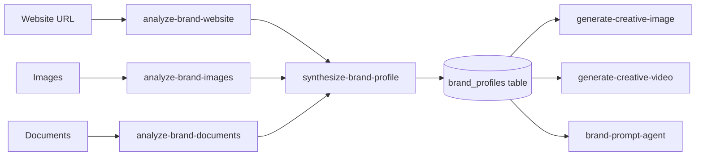
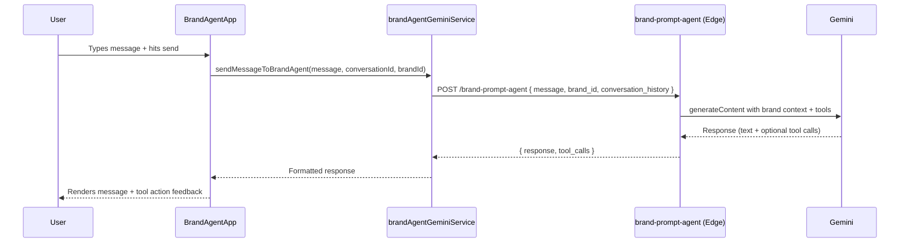

# Architecture Guide

## System Design Overview

**Architectural Pattern:** Three-surface monorepo with shared React component library

Vince has three deployed surfaces — web app, Chrome extension, and mobile (iOS/Android via Capacitor) — that all render the same React component tree from `src/`. The surfaces diverge only at their root files and their Supabase client implementation.

**Layers:**

| Layer | Location | Responsibility |
|-------|----------|----------------|
| UI Components | `src/components/` | Rendering, user interaction |
| Services | `src/services/` | API orchestration, state management logic |
| Supabase Client | `src/integrations/supabase/client.ts` | Auth + DB access (overridden per surface) |
| Edge Functions | `supabase/functions/` | AI orchestration, external API calls |
| External APIs | Gemini, Vertex AI, Google Cloud | Image/video generation, brand analysis |

**Dependency Flow:** Components → Services → Supabase Client / Edge Functions → External APIs

---

## Module Organization

```
vince/
├── src/                          # Shared codebase (all 3 surfaces)
│   ├── components/
│   │   ├── creative-studio/      # ~82 files — main Studio UI
│   │   ├── shared-chat/          # Reusable chat input + messages
│   │   ├── agent-conversations/  # Conversation history UI
│   │   ├── media/                # Media picker, grid, library
│   │   ├── onboarding/           # Setup modals + flows
│   │   ├── shared-settings/      # Settings panels
│   │   ├── ui/                   # shadcn/ui base components
│   │   └── ...                   # voice-visualizer, ai-pulse, etc.
│   ├── services/
│   │   ├── brand-agent/          # Gemini text + Live voice services
│   │   ├── conversationService.ts
│   │   ├── vinceConversationHistory.ts
│   │   └── media/
│   ├── types/
│   │   ├── creative-studio.ts    # ~900 lines — core domain types
│   │   └── media.ts
│   ├── integrations/supabase/
│   │   └── client.ts             # Web Supabase singleton (overridden per surface)
│   ├── contexts/                 # React contexts (Auth, Brand, etc.)
│   ├── hooks/                    # Custom React hooks
│   ├── store/                    # Zustand stores
│   ├── pages/                    # Web app page components
│   ├── constants/
│   ├── lib/                      # Utility functions
│   └── styles/
├── extension/
│   ├── src/
│   │   ├── BrandApp.tsx          # Extension root component
│   │   ├── supabaseExtClient.ts  # Overrides @/integrations/supabase/client
│   │   └── ...tabs/              # PromptBuilderTab, ChatTab, etc.
│   └── vite.config.ts            # Aliases @/integrations/supabase/client
├── mobile/
│   ├── src/
│   │   ├── MobileApp.tsx         # Mobile root + brand theming
│   │   ├── supabaseMobileClient.ts  # Overrides @/integrations/supabase/client
│   │   └── ...tabs/
│   └── vite.config.ts            # Aliases @/integrations/supabase/client
└── supabase/
    ├── functions/                # 19 Deno edge functions
    └── migrations/               # Database schema migrations
```

---

## Three-Surface Pattern

The core architectural decision is that all surfaces render the same `src/` component tree. Surface differentiation is achieved through:

**1. Root component override**
Each surface has its own root (`BrandApp.tsx`, `MobileApp.tsx`, `CreativeStudio.tsx`) that composes the shared components differently — different tab layouts, nav patterns, and theming.

**2. Supabase client override**
Each surface's `vite.config.ts` aliases `@/integrations/supabase/client` to a surface-specific implementation:

- **Web** (`src/integrations/supabase/client.ts`): Standard `createClient` using Vite env vars
- **Extension** (`extension/src/supabaseExtClient.ts`): Same `createClient` but handles Chrome extension auth context
- **Mobile** (`mobile/src/supabaseMobileClient.ts`): `createClient` with Capacitor Preferences for token storage (required because mobile webviews don't persist `localStorage` reliably)

**3. `source` prop propagation**
`BrandAgentApp` accepts a `source?: 'web' | 'ios' | 'mobile'` prop. The mobile root passes `source="mobile"` to suppress quick prompts that don't make sense on small screens. (`src/components/creative-studio/BrandAgentApp.tsx`)

---

## Brand-Centric Data Model

Almost every feature is scoped to a `brand_id`. The brand is the primary organizational unit:

- Users own brands (`CreativeStudioBrand.user_id`)
- Conversations belong to brands
- Prompt templates belong to brands
- Brand intelligence (DNA) is computed per brand and stored in the `brand_profiles` table
- Generation requests carry `brand_id` to inject brand context into prompts

The Brand DNA pipeline flows:



---

## Edge Functions as AI Orchestrators

Edge functions are the AI layer. They:
1. Receive a structured request from the frontend
2. Load brand context from `brand_profiles` if `brand_id` is provided
3. Construct a Gemini/Vertex AI prompt with that context
4. Call the external AI API
5. Return structured results

All 19 functions run on Deno (Supabase edge runtime) and deploy with `verify_jwt: false` — they handle their own auth context. See [03-api-reference.md](03-api-reference.md) for full endpoint specs.

**Function categories:**
| Category | Functions |
|----------|-----------|
| Image generation | `generate-creative-image`, `generate-header-image`, `generate-brand-card-images`, `generate-studio-welcome-images` |
| Video generation | `generate-creative-video` |
| Brand analysis | `analyze-brand-website`, `analyze-brand-images`, `analyze-brand-documents`, `analyze-competitor-video`, `analyze-brand-documents`, `analyze-expansion-direction` |
| Brand intelligence | `synthesize-brand-profile`, `extract-product-catalog`, `generate-brand-guardrails`, `generate-brand-starters` |
| Prompt generation | `brand-prompt-agent`, `generate-brand-prompt`, `synthesize-generation-prompt`, `generate-creative-package`, `enhance-director-prompt` |

---

## Service Layer

Services in `src/services/` mediate between components and the Supabase/edge-function backend. They are plain TypeScript modules (not classes) that export async functions.

**`src/services/brand-agent/brandAgentGeminiService.ts`** — the primary service:
- `sendMessageToBrandAgent()` — calls `brand-prompt-agent` edge function
- `generateBrandAgentGreeting()` — generates contextual greeting from brand DNA
- `fetchBrandContext()` — loads brand, profile, and directives in parallel
- `createBrandAgentConversation()` — creates a conversation record in Supabase

**`src/services/brand-agent/brandAgentLiveService.ts`** — real-time voice:
- Manages a WebSocket connection to Gemini Live API
- Streams audio input and transcription output
- Handles tool calling within the live session
- Used exclusively by `BrandAgentApp` for voice interactions

**`src/services/vinceConversationHistory.ts`** — conversation persistence:
- `fetchRecentConversations()` — recent conversations for a brand
- `loadConversationMessages()` — full message thread

---

## Request Flow

Typical chat message from web UI to AI response:



---

## Brand-Adaptive Theming

Both the extension and mobile surfaces derive a dark theme from the active brand's `primary_color`. The pattern is:

1. Root component reads `brand.primary_color`
2. Calls a local theme derivation function (`deriveMobileBrandTheme()` in `mobile/src/MobileApp.tsx`)
3. Injects CSS variables on the root div (e.g. `--background`, `--accent`)
4. Tailwind classes like `bg-background` and `text-accent` pick up the brand color automatically throughout the component tree

This allows the UI to visually adapt to each brand without conditional rendering.

---

## Key Design Decisions

### Why Supabase Edge Functions for all AI calls?

**Decision:** All Gemini/Vertex AI calls go through Supabase edge functions rather than being called directly from the frontend.

**Trade-offs:**
- ✅ API keys (especially `GEMINI_API_KEY` in Vault) never reach the client
- ✅ Brand context injection happens server-side where the full profile is available
- ✅ Cost tracking and quota checks can be enforced per-request
- ❌ Adds latency vs. direct client calls
- ❌ Requires deployment step to test changes

### Why `verify_jwt: false` on all edge functions?

**Decision:** All edge functions deploy with JWT verification disabled.

**Reason:** The default Supabase `verify_jwt: true` causes 401s because the client auth token format doesn't match what the edge function validator expects in this configuration. Each function handles its own auth by reading `user_id` from the request body or trusting the anon key on public endpoints.

See `scripts/deploy-functions.sh` for the deployment pattern.

### Why no test framework?

**Status (CONFIRMED — no test files found):** There is no automated test suite. The codebase relies on manual testing and TypeScript's type system for quality gates. This is a known gap.
