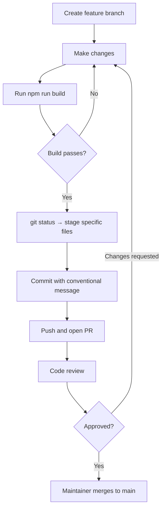

# Contributing Guide

## Code Standards

**Language:** TypeScript 5.8 with relaxed settings (`noImplicitAny: false`, `strictNullChecks: false` — confirmed in `tsconfig.json`). This means TypeScript won't catch many common bugs. Be deliberate about null handling.

**Framework:** React 18 functional components with hooks. No class components.

**Styling:** Tailwind CSS 3.4 utility classes. Base components from shadcn/ui (in `src/components/ui/`). Do not write custom CSS unless Tailwind cannot express the style.

**Formatting and Linting:** ⚠️ No ESLint or Prettier configuration exists in this codebase. Code style is enforced by convention and peer review. Match the style of the file you're editing.

**Naming Conventions:**
- Components: `PascalCase` (e.g., `BrandAgentApp.tsx`)
- Hooks: `camelCase` prefixed with `use` (e.g., `useBrandProfile.ts`)
- Services: `camelCase` files, exported functions (e.g., `sendMessageToBrandAgent`)
- Supabase tables: `snake_case` (e.g., `brand_profiles`)
- CSS variables: `kebab-case` with `--` prefix (e.g., `--background`, `--accent`)

**File Header Convention (required):**
Every code file must start with two ABOUTME comment lines:
```typescript
// ABOUTME: One-line description of what this file does
// ABOUTME: Second line for additional context if needed
```
This is a project-wide convention. Any file you create must include it. Any file you significantly modify should have its ABOUTME updated if it's stale.

---

## Git Workflow

**Branch naming:**
- `feat/description` — new features
- `fix/description` — bug fixes
- `docs/description` — documentation
- `refactor/description` — refactoring without behavior change

**Commit message format:**
```
type: short description

- Detail 1
- Detail 2

Closes #issue-number (if applicable)
```

**Types:** `feat`, `fix`, `docs`, `refactor`, `test`, `chore`

**Examples from recent history:**
```
feat(mobile): Brand/Prompts/Campaigns tabs, security hardening, package rename
feat(extension): chat, campaign history, creations tab, prompt builder
docs(mobile): add dedicated mobile app spec document
```

**When to rebase vs merge:**
- Rebase feature branches onto `main` before creating a PR to keep history clean.
- Never rebase commits that have been pushed and shared with others.

---

## Pull Request Process

### 1. Create a feature branch
```bash
git checkout -b feat/your-feature
```

### 2. Make changes
- Follow the ABOUTME header convention for any new file
- Update existing ABOUTME headers if the file's purpose has changed
- Keep changes focused — one PR per logical change

### 3. Run pre-submission checks
```bash
npm run build          # TypeScript must compile with 0 errors
```
There is no linter or test runner to execute. The build is the primary gate.

### 4. Stage and commit
```bash
git status             # review what changed before staging
git add src/components/path/to/changed/file.tsx   # add specific files
git commit -m "feat: description

- Implementation detail 1
- Implementation detail 2"
```

> ⚠️ Do not use `git add -A` or `git add .` without first reviewing `git status`. This prevents accidentally committing debug files, generated assets, or secrets.

### 5. Push and open PR
```bash
git push origin feat/your-feature
```

Open a PR on GitHub targeting `main`.

### 6. Address review feedback
- Push additional commits in response to review (do not force-push during review)
- Respond to all comments before requesting re-review

### 7. Merge
Maintainer merges once approved.

---

## Code Review Checklist

- [ ] ABOUTME header present and accurate on new/modified files
- [ ] TypeScript build passes (`npm run build`)
- [ ] No hardcoded secrets, API keys, or credentials
- [ ] `brand_id` is passed to any function that generates or analyzes content (for context injection)
- [ ] New edge functions deploy with `verify_jwt: false` in `scripts/deploy-functions.sh`
- [ ] Error states handled — no silent failures
- [ ] Mobile/extension surfaces considered if change affects shared components

---

## Edge Function Contribution Notes

When adding or modifying a Supabase edge function:

1. Add the deploy command to `scripts/deploy-functions.sh` with the `--no-verify-jwt` flag
2. Follow the existing function structure: CORS headers, `OPTIONS` preflight handler, main `POST` handler
3. Load brand context from `brand_profiles` if your function takes a `brand_id`
4. Document the new function in [03-api-reference.md](03-api-reference.md)

**Template pattern** (confirmed from `supabase/functions/*/index.ts`):
```typescript
// ABOUTME: What this function does
// ABOUTME: Second line of context

const corsHeaders = {
  'Access-Control-Allow-Origin': '*',
  'Access-Control-Allow-Headers': 'authorization, x-client-info, apikey, content-type',
};

Deno.serve(async (req) => {
  if (req.method === 'OPTIONS') {
    return new Response('ok', { headers: corsHeaders });
  }

  try {
    const { brand_id, user_id, ...params } = await req.json();
    // ... implementation
    return new Response(JSON.stringify({ success: true, ... }), {
      headers: { ...corsHeaders, 'Content-Type': 'application/json' },
    });
  } catch (error) {
    return new Response(JSON.stringify({ success: false, error: error.message }), {
      status: 500,
      headers: { ...corsHeaders, 'Content-Type': 'application/json' },
    });
  }
});
```

---

## PR Flowchart


