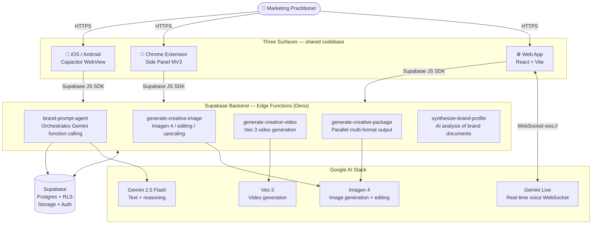

 

## How Vince Works

Vince is a conversation-driven orchestration layer over Google's AI stack. A brief — spoken or typed — triggers a pipeline that retrieves brand context, expands the prompt through brand-conditioned rules, fans out to the appropriate Gemini model, and streams results back to the user.

---

## Documentation by Audience

Each section is written for a specific reader — same system, different depth.

**👤 End Users**
You're a marketer who generates campaigns, not a developer.

→ [Welcome & first brief](/user/01-welcome)
→ [Feature guides](/user/02-feature-guides)
→ [FAQ & troubleshooting](/user/03-faq)

**🎨 Creators & Power Users**
You run campaigns, manage prompts, and push what Vince can do.

→ [Generation workflows](/creator/02-generation-workflows)
→ [Prompt templates](/creator/03-prompt-templates)
→ [Media management](/creator/04-media-management)

**⚙️ System Admins**
You configure brands, manage users, and keep the platform running.

→ [Deployment guide](/admin/01-deployment-guide)
→ [Configuration reference](/admin/02-configuration-reference)
→ [Operations runbooks](/admin/06-operations-runbooks)

**🛠️ Developers**
You build on top of Vince or contribute to the codebase.

→ [Getting started](/developer/01-getting-started)
→ [API reference](/developer/03-api-reference)
→ [Code patterns](/developer/07-code-patterns)

**🏗️ Architects**
You need to understand the system at depth — security, data, and decisions.

→ [System overview](/architecture/01-system-overview)
→ [C4 diagrams](/architecture/02-architecture-c4)
→ [Architecture decisions](/architecture/06-decisions-adr)

---

## Technology Stack

| Layer | Technology | Purpose |
|-------|-----------|---------|
| **Frontend** | React 18 + TypeScript + Vite | All three surfaces — web, extension, mobile |
| **Mobile** | Capacitor | Native iOS/Android wrapper around the web bundle |
| **Extension** | Chrome Manifest V3 | Side panel with isolated auth client |
| **State** | Zustand + TanStack Query | Local UI state + server cache |
| **Backend** | Supabase Edge Functions (Deno) | All server-side AI orchestration |
| **Database** | PostgreSQL + Row-Level Security | Per-user data isolation enforced at the DB layer |
| **Voice** | Gemini Live WebSocket | Real-time bidirectional audio, <200ms round-trip |
| **Image** | Google Imagen 4 via Vertex AI | Text-to-image, editing, upscaling, virtual try-on |
| **Video** | Google Veo 3 | Short-form video generation from text briefs |
| **Text** | Gemini 2.5 Flash | Conversation, prompt expansion, brand reasoning |
| **Auth** | Supabase Auth + custom RLS | Email/password, role-based access (user/admin) |
| **Hosting** | Google Cloud Run | Containerized web app behind nginx |
