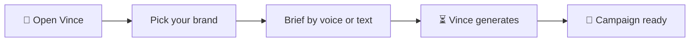

# Welcome to Vince!

Vince is your AI creative director. You brief him by voice — like talking to a designer — and he builds you a complete marketing campaign: copy, images, and all the formats your team needs.

**What you'll do in the next 10 minutes:**
- ✅ Sign in to Vince
- ✅ Pick your brand
- ✅ Give Vince your first creative brief
- ✅ See your first campaign come to life

**Already have an account and a brand set up?** [Skip to feature guides →](02-feature-guides.md)

---

## Sign In

1. **Go to the Vince URL your team gave you**

2. **Enter your email address and password**
   - Use the email your admin set up for you
   - If you don't have an account, ask your team admin to create one

3. **Click "Sign In"**

<ScreenshotCard title="Sign In" route="/login" imagePath="/visual-manual/screenshots/01-login.png" />

You'll land on the main Vince screen. That's it — no email confirmation needed.

**Can't sign in?**
- Double-check your email and password
- Make sure Caps Lock is off
- Contact your admin if you need a password reset

---

## Pick Your Brand

When you first arrive, Vince shows you a welcome screen. If your team has already set up a brand, you'll see it in the brand picker.

1. **Click on your brand's name** in the sidebar or brand picker

Vince loads everything he knows about your brand — colors, voice, imagery rules, all of it. You'll see the brand name appear at the top.

**Don't see your brand?** Your admin may need to set it up first. Check with them.

---

## Give Vince Your First Brief

This is where the magic happens. Vince understands plain English — no special commands needed.

### Option A: Brief by Voice (recommended)

1. **Click the microphone button** in the chat area
2. **Speak your brief naturally** — for example:
   > *"Vince, I need a campaign for our spring sale. It's a 20% off promotion targeting women 25 to 40. The tone should feel fresh and optimistic."*
3. **Click the microphone again** (or pause) when you're done talking
4. Vince will confirm he heard you and start building

### Option B: Brief by Text

1. **Click in the message box** at the bottom of the screen
2. **Type your brief**
3. **Press Enter or Cmd+Enter** to send

**That's it!** Vince goes to work. You'll see a progress indicator while he generates your campaign.

---

## See Your Results

When Vince is done, your campaign appears right in the chat. You'll see:

- **Headline copy** — the main message, already written in your brand's voice
- **Images** — generated with your brand's visual style baked in
- **Campaign formats** — the same creative adapted for billboard, social, email, and more

Click any image to view it full size. Your campaign is also saved automatically — find it anytime under **My Campaigns**.

**Tip:** Not quite right? Just tell Vince. Say *"make it more energetic"* or *"try a darker mood"* — he'll revise.

---

## What's Next?

Now that you've got the basics, here's what else Vince can do:

- **Video** — Brief Vince for a video campaign, and he'll generate a short clip
- **Competitor analysis** — Paste a competitor's URL or video, and Vince builds a counter-campaign
- **Prompt library** — Save briefs that work well and reuse them
- **Brand DNA** — See exactly what Vince knows about your brand

**Need help?** Check out our [FAQ](03-faq.md) or [troubleshooting guide](04-troubleshooting.md).
