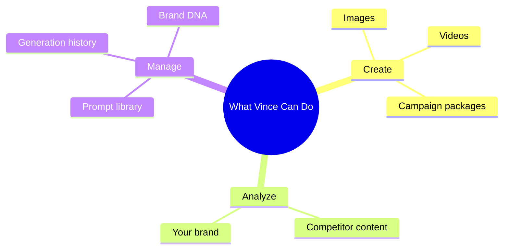

# Feature Guides

Learn how to get things done with Vince.

---

## Talking to Vince

**What it does:** Vince understands creative briefs spoken or typed in plain language. You don't need to fill out forms or learn special commands.

**When to use it:** Every time you need creative work done.

---

### How to give a great brief

A good brief tells Vince three things: **what** you're promoting, **who** it's for, and **what feeling** you want.

**Example briefs that work well:**

> *"Campaign for our new running shoe. Target serious athletes, 25–45. Bold and motivating — like Nike, but grittier."*

> *"Email header for a holiday promotion. 30% off everything. Warm, festive, not cheesy."*

> *"Social post announcing a store opening in Austin. Excited, community-focused vibe."*

**Tip:** You don't have to get it perfect the first time. Brief Vince, see what he makes, then refine with follow-up messages.

---

### How to use voice input

1. **Click the microphone button** in the message area
   - The button glows when Vince is listening
2. **Speak your brief**
3. **Stop speaking** — Vince detects the pause and responds
4. **Keep talking** to continue the conversation

**Tip:** Treat it like talking to a colleague, not a search engine. Full sentences work better than keywords.

<ScreenshotCard title="Vince Chat" route="/vince" imagePath="/visual-manual/screenshots/06-vince-tab-chat.png" />

---

### How to attach a reference image

You can show Vince an image to inspire or guide the visual direction.

1. **Click the attachment button** (paperclip icon) in the message area
2. **Select your image file**
3. **Type your brief** referencing the image — e.g., *"Use this as a reference for the mood"*
4. **Send**

INFERRED: Based on `InputArea.tsx` which includes a file upload button alongside the message field.

---

## Generating Images

**What it does:** Vince creates brand-aligned images from your brief. Your brand's visual rules (colors, photography style, product placement) are applied automatically.

**When to use it:** When you need visuals for campaigns, ads, social, or presentations.

---

### How to generate a single image

1. **Make sure "Image" mode is selected** in the generation mode bar (below the canvas)
2. **Type or speak your brief** in the Vince chat panel on the right
3. Vince generates the image and shows it in the canvas

**Result:** One image, brand-compliant, ready to download.

---

### How to generate a campaign (copy + images together)

This is Vince's most powerful feature. Ask him for a campaign and he delivers everything at once.

1. **Brief Vince** — ask for a campaign package. For example:
   > *"I need a full campaign for the spring collection launch. Billboard, social, and email."*
2. Vince generates copy and images for each format simultaneously
3. Your **Creative Package** appears in the chat with all formats listed

**Formats Vince delivers** (CONFIRMED — `generate_creative_package` tool):
- Billboard
- Out-of-Home (OOH)
- Social media
- Email header
- And more based on your brief

**Tip:** Download the whole package as a ZIP file for handoff to your production team.

---

### How to edit an existing image

1. **Select the image** on the canvas (click it)
2. **Switch to "Edit" mode** in the generation mode bar
3. **Brief Vince** on what to change — *"Remove the background"*, *"Add a sunset sky"*, *"Make the product more prominent"*
4. Vince edits and shows the result

---

## Generating Video

**What it does:** Vince creates short video clips from your creative brief.

**When to use it:** Social video, campaign teasers, presentation assets.

---

### How to create a video

1. **Select "Video" mode** in the generation mode bar
2. **Brief Vince** — include the action, mood, and subject:
   > *"Close-up of a runner on a wet track at dawn. Gritty, slow-motion."*
3. Vince queues the video — it takes a bit longer than images
4. When ready, the video appears in your **Generations** tab

**Note:** Video generation runs in the background. You can keep working while it processes.

---

## Analyzing Competitors

**What it does:** Paste a competitor's ad URL or video, and Vince tells you what they're claiming, where they're vulnerable, and how to counter them.

**When to use it:** Campaign planning, pitch prep, new business.

---

### How to analyze a competitor video

1. **Open the Vince chat panel**
2. **Paste the competitor video URL** and ask Vince to analyze it:
   > *"Analyze this competitor's ad and tell me where we can beat them: [URL]"*
3. Vince returns:
   - A summary of their message and claims
   - Identified weaknesses
   - 3 strategic counter-campaign directions

**Result:** A strategic brief you can turn into a counter-campaign immediately.

---

## Using the Prompt Library

**What it does:** Save briefs that work well so you can reuse them. Great for repeatable campaign types.

**When to use it:** When you find a brief that consistently produces great results.

---

### How to save a prompt

Ask Vince to save it for you:
> *"Save this prompt to my library — label it 'Product launch, bold tone'"*

CONFIRMED: `save_prompt_template` tool in `BrandAgentApp.tsx`

---

### How to use a saved prompt

1. **Open the Prompt Library** panel (left sidebar or via Vince)
2. **Browse or search** your saved prompts
3. **Click a prompt** to load it into the message area
4. **Edit any variables** (marked with <code v-pre>{{double brackets}}</code>) and send

---

## Viewing Your Generation History

**What it does:** Every image and campaign Vince creates is saved. Come back anytime to find and reuse past work.

**When to use it:** When you need to find something you generated before, or want to download assets.

---

### How to find past generations

1. **Open the History panel** in the left sidebar
2. **Browse thumbnails** of recent generations
3. **Click any thumbnail** to load it back onto the canvas

For a full searchable view, go to the **Generations** tab at the top of the screen. Filter by date, type (image vs. video), or status.

---

## Understanding Your Brand DNA

**What it does:** Brand DNA is everything Vince knows about your brand — colors, voice, photography rules, and compliance guidelines. It's automatically applied to every generation.

**When to use it:** Review it to understand what Vince is working with. Your admin can update it.

---

### How to view your Brand DNA

1. **Click "Brand DNA"** in the left panel or sidebar
2. The panel shows your brand's:
   - Color palette and typography
   - Copy voice and tone
   - Photography and art direction rules
   - Compliance guidelines

**Note:** You can view Brand DNA but editing it is typically done by your team's admin.

<ScreenshotCard title="Brand Intelligence" route="/vince" imagePath="/visual-manual/screenshots/08-vince-tab-brand-intel.png" />

---

## Tips & Tricks

**Keyboard shortcuts:**
- `Cmd+Enter` (Mac) / `Ctrl+Enter` (Windows) — Send your message
- `Arrow keys` — Navigate the showcase slides
- `Escape` — Close the showcase

**Did you know?**
- Vince remembers your brand automatically — you never have to attach guidelines
- You can brief Vince mid-session to change direction: *"Actually, let's go darker"*
- The Vince Chrome Extension gives you access from any tab in your browser

**Power user tip:**
Use variable placeholders in saved prompts — like <code v-pre>{{product_name}}</code> or <code v-pre>{{tone}}</code> — so one template works for many campaigns.
