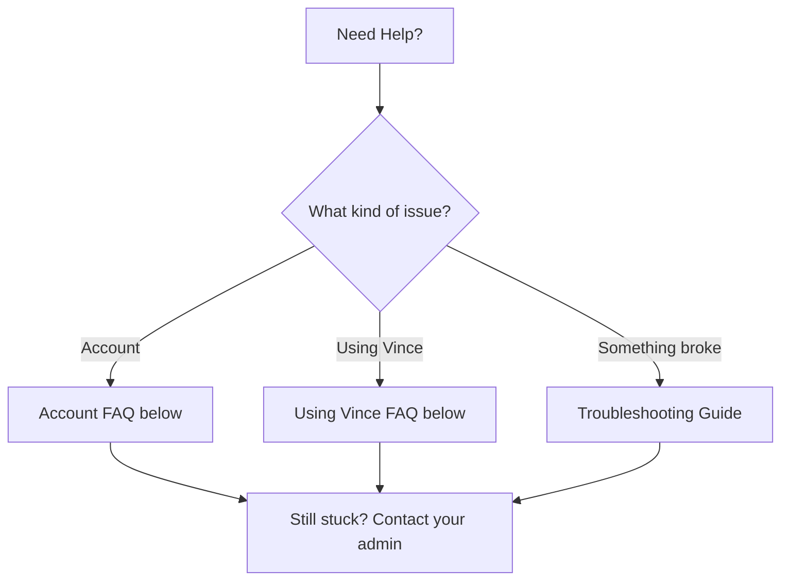

# Frequently Asked Questions

Can't find your answer? Contact your team admin or [reach out to the Vince team](mailto:support@example.com).

---

## Account

### How do I get an account?

Vince accounts are created by your team admin. Ask them to set one up for you — they'll send you your login credentials.

CONFIRMED: No self-service signup UI exists (`src/App.tsx`, `src/pages/Login.tsx`)

---

### How do I reset my password?

⚠️ REQUIRES VERIFICATION: A password reset flow was not found in the codebase. Contact your team admin to reset your password.

---

### Can I change my email address?

Contact your team admin. Email address changes are managed at the account level by an administrator.

---

### What browsers does Vince work in?

INFERRED: Vince is a web app built with modern web technologies. Current browsers (Chrome, Firefox, Safari, Edge) should all work. The Chrome Extension is Chrome-only.

For the best experience — especially voice features — use **Google Chrome**.

---

### Is there a mobile app?

Yes. Vince has iOS and Android apps available. Ask your admin about access.

CONFIRMED: Capacitor mobile app exists at `mobile/` in the codebase.

---

## Using Vince

### What's the best way to brief Vince?

Tell him what you're promoting, who it's for, and what feeling you want. Full sentences work better than keywords.

**Good:** *"Campaign for a luxury watch. Men 35+, successful, understated. Think quiet confidence, not flashy."*

**Less good:** *"watch ad mens luxury"*

You can always refine — brief him, see what he makes, then give feedback in plain language.

---

### Does Vince use my brand automatically?

Yes. Once you select your brand, Vince applies your brand's colors, photography rules, voice, and guidelines to everything he generates. You don't need to attach anything.

CONFIRMED: pgvector brand memory is injected into every generation call (`BrandAgentApp.tsx`)

---

### How many images can I generate?

Your team has a generation quota (a set number of images and videos per period). You can see your remaining balance in the interface.

CONFIRMED: `check_generation_quota` tool and quota display in `BrandAgentApp.tsx`

If you're running low, ask your admin about increasing the limit.

---

### Can I generate video?

Yes. Select "Video" mode and brief Vince. Videos take longer to generate than images and run in the background — you'll find them in your **Generations** tab when ready.

CONFIRMED: Veo video generation via `generate_creative_package` and video mode in `BrandShopPromptBar.tsx`

---

### Where do my generations go?

Every image and video Vince creates is saved automatically. Find them in:
- **History panel** — recent thumbnails in the left sidebar
- **Generations tab** — full searchable history with filters
- **My Campaigns page** — campaign packages grouped together

CONFIRMED: `HistoryPanel.tsx`, `GenerationsTab.tsx`, `MyCampaigns.tsx`

---

### Can I download my work?

Yes. Click any image to view it, then download. For campaign packages, there's a ZIP download that includes all formats.

---

### Can Vince analyze a competitor's ad?

Yes. Paste a competitor's video URL into the chat and ask Vince to analyze it. He'll return a strategic summary, their key claims, where they're vulnerable, and counter-campaign directions.

CONFIRMED: `analyze_competitor_video` and `analyze-competitor-video` edge function

---

### What generation modes are there?

CONFIRMED from `BrandShopPromptBar.tsx`:

| Mode | What it does |
|------|-------------|
| **Image** | Generate a new image from your brief |
| **Edit** | Modify an existing image (remove objects, change background, etc.) |
| **Video** | Generate a short video clip |
| **Upscale** | Increase the resolution of an image |
| **Product** | Place your product into a new scene or background |
| **Try-On** | Virtually try clothing or accessories on a model |
| **Chat Edit** | Edit an image through back-and-forth conversation |

---

## Data & Security

### Is my data secure?

Yes. Vince is built on Supabase, which provides:
- Encrypted connections (HTTPS)
- Row-level security — you only see your own work (admins see all)
- Data stored in a managed cloud database

CONFIRMED: Supabase auth and row-level security policies in the codebase

---

### Does Vince see my brand guidelines?

Yes — that's the point. Your brand guidelines, images, and rules are stored securely and used to guide every generation. Vince does not share your brand data with other companies' brands.

---

### Who can see my generations?

- **You** can always see your own work
- **Admins** on your team can see all generations across all users

CONFIRMED: Role-based RLS policies (`user_roles` table, `GenerationsTab.tsx` admin view)

---

### Can I delete a generation?

Ask your admin. Admins can archive or delete generations.

CONFIRMED: `archived_at` soft-delete column added in migrations; admin delete RLS policy exists
