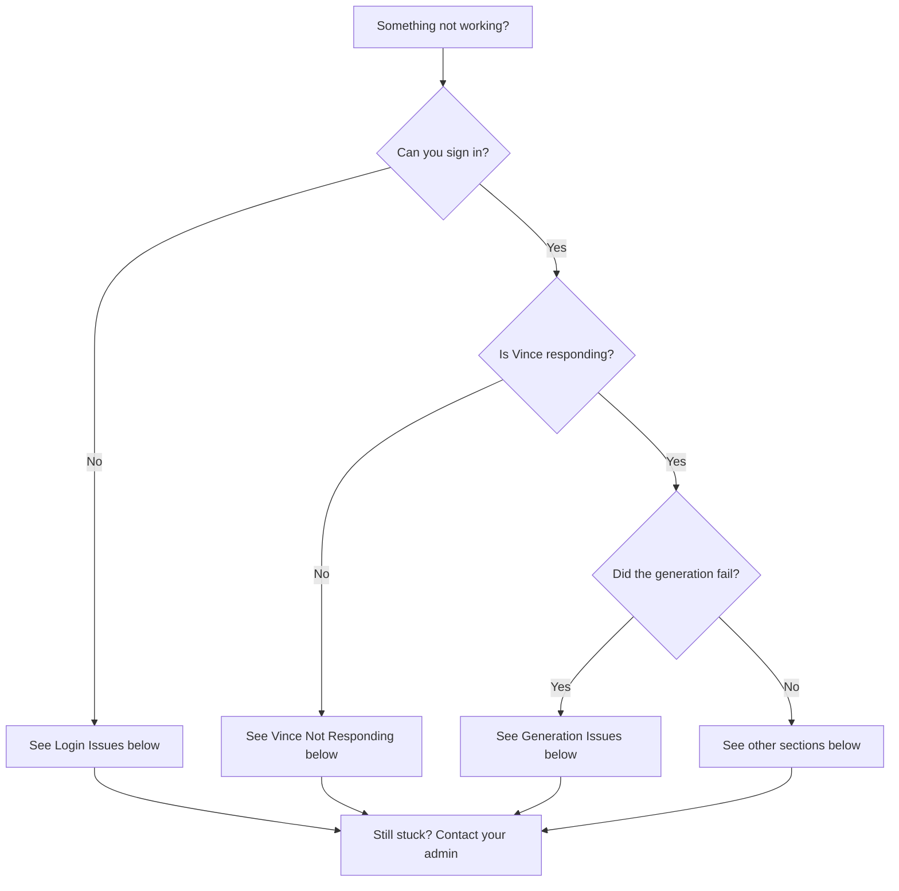

# Troubleshooting Guide

Having issues? Find your problem below.

---

## Login Issues

### "Invalid credentials. Please try again."

CONFIRMED: This exact error message exists in `src/pages/Login.tsx`

**Solutions:**

✅ **Check your email and password**
- Make sure there are no extra spaces before or after
- Check that Caps Lock is off
- Try typing your password into a text editor first to confirm it's right, then paste it in

✅ **Try a different browser**
- If you're using Safari, try Chrome
- Clear your browser cache: Settings → Clear browsing data

✅ **Contact your admin**
- Your account may have been set up with a different email address than you expect
- Your admin can confirm your login email

---

### The sign-in page won't load

✅ **Check your internet connection**
- Try loading another website to confirm you're online

✅ **Try a hard refresh**
- Mac: `Cmd + Shift + R`
- Windows: `Ctrl + Shift + R`

✅ **Try a different browser or device**

---

## Voice Issues

### The microphone button isn't working

✅ **Check browser microphone permission**
1. Look for a microphone icon in your browser's address bar
2. Click it and select "Allow"
3. Refresh the page and try again

✅ **Check your system microphone**
- Make sure your microphone isn't muted at the system level
- On Mac: System Settings → Sound → Input — check your mic is selected and active
- On Windows: Settings → System → Sound — check your input device

✅ **Try a different browser**
- Voice works best in Google Chrome

---

### Vince is listening but not responding to what I say

✅ **Speak clearly and pause at the end**
- Vince waits for a natural pause before responding — wait a beat after you finish speaking

✅ **Check background noise**
- Heavy background noise can interfere — move somewhere quieter if possible

✅ **Switch to text input as a fallback**
- Click in the message box and type your brief instead
- Voice and text produce the same results

---

### I can't hear Vince's voice responses

✅ **Check your system volume**
✅ **Check that your browser tab isn't muted**
- Right-click your browser tab — make sure "Mute site" is not checked

---

## Generation Issues

### "Failed to generate"

✅ **Check your quota**
- You may have used up your generation limit for the period
- Look for a quota indicator in the interface
- Contact your admin if you need more

✅ **Simplify your brief**
- Very long or complex prompts occasionally cause issues
- Try a shorter, clearer brief

✅ **Try again**
- Temporary errors happen. Wait 30 seconds and try the same brief again

---

### The image doesn't match my brief at all

✅ **Be more specific**
- Add details: subject, mood, color direction, composition
- Reference what you *don't* want: *"Not dark — bright and airy"*

✅ **Check your brand is selected**
- If no brand is selected, Vince generates without brand context
- Make sure your brand name appears at the top of the screen

✅ **Ask Vince to try again**
- Just say: *"Try that again, but..."* and add what was missing

---

### My video never appeared

Video generation takes longer than images and runs in the background.

✅ **Check the Generations tab**
- Go to the Generations tab at the top of the screen
- Filter by "Video" type
- Look for a "Processing" status — it may still be working

✅ **Wait a few more minutes**
- Video can take several minutes depending on length and complexity

✅ **Try again if status shows "Failed"**
- If it shows Failed, try the same brief again

---

### My campaign package is missing some formats

✅ **Check if the brief was specific about formats**
- Add format requests to your brief: *"I need billboard, social, and email versions"*

✅ **Ask Vince to generate the missing format**
- *"Now give me the email header version"*

---

## Mobile App Issues

### The app crashes on startup

**iPhone/iPad:**
1. Close the app completely (swipe up from home, swipe away the app card)
2. Restart the app
3. If still crashing: Delete and reinstall the app

**Android:**
1. Go to Settings → Apps → Vince → Force Stop
2. Reopen the app
3. If still crashing: Clear app cache (Settings → Apps → Vince → Storage → Clear Cache), then reopen

---

### Voice doesn't work on mobile

✅ **Check microphone permission**
- iPhone: Settings → Vince → Microphone → Allow
- Android: Settings → Apps → Vince → Permissions → Microphone → Allow

✅ **Restart the app** after granting permission

---

### I'm signed in on web but not on mobile (or vice versa)

Sign-in is separate on each surface. Sign in again on the mobile app using the same email and password.

---

## Still Need Help?

**Contact your team admin** — they can reset passwords, adjust quotas, and troubleshoot account issues.

**Gather this information before reaching out:**
- Screenshot of the error or issue
- What you were trying to do
- What happened instead (error message, blank screen, etc.)
- Which browser or device you were using
